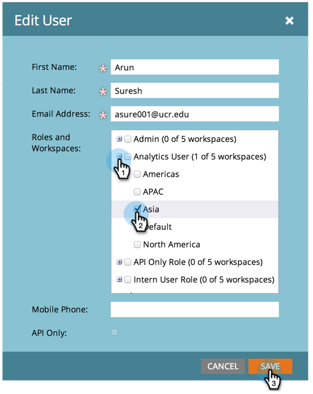
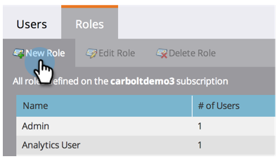
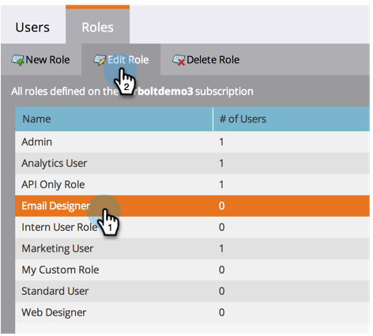
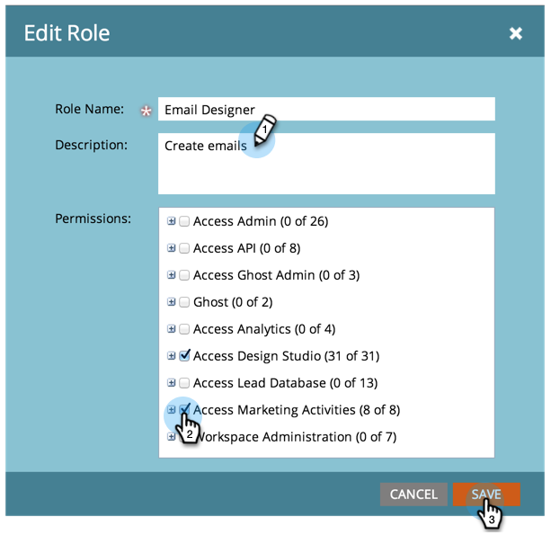

# 管理用户角色和权限 {#managing-user-roles-and-permissions}

设置、创建和编辑用户角色，并将其分配给用户。 这允许您控制每个Marketo用户有权访问的区域和功能。

例如，营销用户通常需要在整个应用程序中拥有广泛的访问权限，以便创建、修改和部署电子邮件、登陆页面和项目。 另一方面，Web设计师几乎所有时间都在Design Studio中，创建用于电子邮件和登陆页面的资产。 虽然公司领导人在Analytics区域广泛使用Marketo的报表，但他们可能不需要自己创建或驱动资产或程序。

>[!NOTE]
>
>**需要管理员权限**

Marketo提供了多个具有不同访问级别的内置角色：

* **管理员**  — 应用程序的所有部分，包括“管理员”部分
* **标准用户**  — 应用程序的所有部分，“管理员”部分除外
* **营销用户**  — 应用程序的所有部分，“管理员”部分除外
* **Web设计工具**  — 仅Design Studio
* **Analytics用户**  — 仅Analytics部分

您无法编辑“管理员”和“标准用户”角色，但可以编辑其他角色。 您还可以创建新的自定义角色以匹配公司中的特定组织结构。

## 具有Adobe标识的Marketo {#marketo-with-adobe-identity}

如果您将Marketo与Adobe标识一起使用，则会显示配置文件描述列表 [可在此处找到](/help/marketo/product-docs/administration/marketo-with-adobe-identity/overview.md#profile-levels).

## 为用户分配角色 {#assign-roles-to-a-user}

您可以在 [首次创建用户](/help/marketo/product-docs/administration/users-and-roles/create-delete-edit-and-change-a-user-role.md) 或 [编辑现有用户](/help/marketo/product-docs/administration/users-and-roles/managing-marketo-users.md).

1. 要编辑现有用户，请转到 **管理员** 单击 **用户和角色**.

   

1. 从列表中选择要编辑的用户，然后单击 **编辑用户**.

   

1. 在 **角色**，根据用户需要的权限选择要分配给用户的角色，然后单击 **保存**.

   

   >[!NOTE]
   >
   >要了解每个角色，请参阅  [角色权限描述](/help/marketo/product-docs/administration/users-and-roles/managing-user-roles-and-permissions/descriptions-of-role-permissions.md).

## 创建新角色 {#create-a-new-role}

有时，贵组织的员工具有非常特定的角色，需要自定义权限组合。

1. 要创建新用户角色，请转到“管理员”并单击 **用户和角色**.

   

1. 单击 **角色** 选项卡。

   

1. 单击 **新角色**.

   

1. 输入 **角色名称**, a **描述** （可选），然后选择此角色中的用户需要的权限。

   

## 编辑角色 {#edit-a-role}

如果您需要更改与现有角色关联的权限，则可以编辑角色。

1. 转到 **管理员** 单击 **用户和角色**.

   

1. 单击 **角色** 选项卡。

   

1. 从列表中选择要修改的角色并单击 **编辑角色**.

   

1. 更改 **角色名称** 和 **描述** 如有必要，然后更改关联的 **权限**.

   

   >[!NOTE]
   >
   >拥有您编辑角色的用户在注销后再次登录后将收到修改后的权限。

## 删除角色 {#delete-a-role}

如果角色变得不必要，您可以删除它。

1. 转到“管理员”并单击 **用户和角色**.

   

1. 单击 **角色** 选项卡。

   

1. 从列表中选择要删除的角色，然后单击 **删除角色**.

   

1. 单击 **删除** 确认。

   
