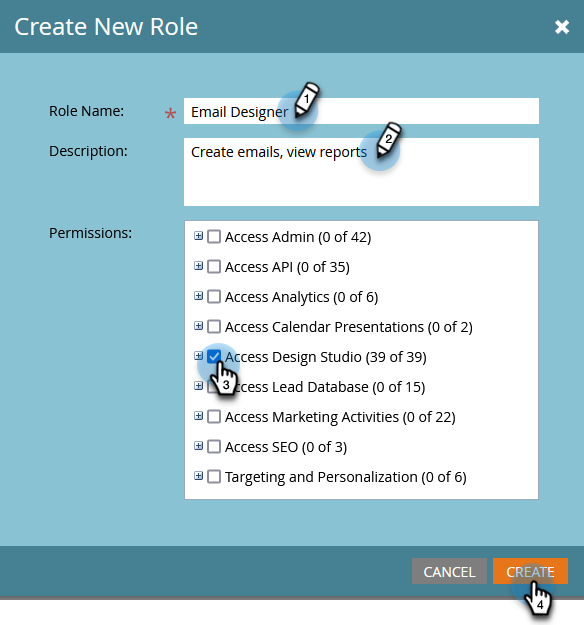

# 管理用户角色和权限 {#managing-user-roles-and-permissions}

设置、创建和编辑用户角色，并将其分配给用户。 这样，您就可以控制每个Marketo用户有权访问的区域和功能。

例如，营销用户通常需要在整个应用程序中拥有广泛的访问权限，才能创建、修改和部署电子邮件、登陆页面和程序。 另一方面，Web设计人员几乎将所有时间都花在Design Studio中，创建用于电子邮件和登陆页面的资产。 虽然公司领导可以在Analytics区域广泛使用Marketo的报告，但他们可能不需要自己创建或推动资源或程序。

>[!NOTE]
>
>**需要管理员权限**

Marketo提供了多个内置角色，具有不同的访问级别：

* **管理员** — 应用程序的所有部分，包括“管理员”部分
* **标准用户** — 应用程序的所有部分，管理部分除外
* **营销用户** — 应用程序的所有部分，管理员部分除外
* **Web Designer** — 仅设计工作室
* **Analytics用户** — 仅Analytics部分

您无法编辑管理员和标准用户角色，但可以编辑其他角色。 您还可以创建新的自定义角色，以匹配公司中的特定组织结构。

## 具有Adobe身份的Marketo {#marketo-with-adobe-identity}

如果您正在将Marketo与Adobe标识一起使用，则可以在此处[找到配置文件描述](/help/marketo/product-docs/administration/marketo-with-adobe-identity/adobe-identity-management-overview.md#profile-levels)的列表。

## 将角色分配给用户 {#assign-roles-to-a-user}

在[首次创建用户](/help/marketo/product-docs/administration/users-and-roles/create-delete-edit-and-change-a-user-role.md)或通过[编辑现有用户](/help/marketo/product-docs/administration/users-and-roles/managing-marketo-users.md)时，可以为用户分配角色。

1. 转到&#x200B;**[!UICONTROL Admin]**&#x200B;区域。

   

1. 单击 **[!UICONTROL Users & Roles]**。

   

1. 从列表中选择要编辑的用户，然后单击&#x200B;**[!UICONTROL Edit User]**。

   

1. 在&#x200B;**[!UICONTROL Roles]**&#x200B;下，根据所需权限选择要分配给用户的角色，然后单击&#x200B;**[!UICONTROL Save]**。

   

   >[!NOTE]
   >
   >要了解每个角色，请参阅[角色权限的说明](/help/marketo/product-docs/administration/users-and-roles/descriptions-of-role-permissions.md)。

## 创建新角色 {#create-a-new-role}

有时，贵组织有员工担任非常特定的角色，这些角色需要自定义权限组合。

1. 转到&#x200B;**[!UICONTROL Admin]**&#x200B;区域。

   

1. 单击 **[!UICONTROL Users & Roles]**。

   

1. 单击&#x200B;**[!UICONTROL Roles]**&#x200B;选项卡。

   

1. 单击 **[!UICONTROL New Role]**。

   

1. 输入&#x200B;**[!UICONTROL Role Name]**&#x200B;和&#x200B;**[!UICONTROL Description]**（可选），然后选择此角色中的用户所需的权限。

   

## 编辑角色 {#edit-a-role}

如果需要更改与现有角色关联的权限，可以编辑该角色。

1. 转到&#x200B;**[!UICONTROL Admin]**&#x200B;区域。

   

1. 单击 **[!UICONTROL Users & Roles]**。

   

1. 单击&#x200B;**[!UICONTROL Roles]**&#x200B;选项卡。

   

1. 从列表中选择要修改的角色，然后单击&#x200B;**[!UICONTROL Edit Role]**。

   

1. 如有必要，请更改&#x200B;**[!UICONTROL Role Name]**&#x200B;和&#x200B;**[!UICONTROL Description]**，更改相关&#x200B;**[!UICONTROL Permissions]**&#x200B;的选择，并在完成后单击&#x200B;**[!UICONTROL Save]**。

   

   >[!NOTE]
   >
   >拥有您编辑的角色的用户在注销并重新登录后将收到修改后的权限。

## 删除角色 {#delete-a-role}

如果某个角色变得不必要，您可以将其删除。

1. 转到&#x200B;**[!UICONTROL Admin]**&#x200B;区域。

   

1. 单击 **[!UICONTROL Users & Roles]**。

   

1. 单击&#x200B;**[!UICONTROL Roles]**&#x200B;选项卡。

   

1. 从列表中选择要删除的角色，然后单击&#x200B;**[!UICONTROL Delete Role]**。

   

1. 单击&#x200B;**[!UICONTROL Delete]**&#x200B;确认。

   
