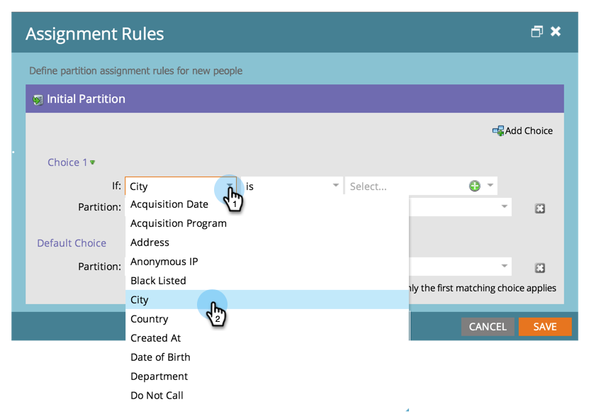

# 使用分配规则分配人员分区 {#assigning-person-partitions-with-assignment-rules}

>[!NOTE]
>
>**需要管理员权限**

>[!PREREQUISITES]
>
>[创建人员分区](/help/marketo/product-docs/administration/workspaces-and-person-partitions/create-a-person-partition.md)

使用人员分区时，请设置分配规则以将从CRM创建的人员路由到其各自的分区。

>[!NOTE]
>
>只有在Marketo中通过CRM和SOAP API创建的人员才会应用分配规则。

1. 转到 **管理员** 区域。

   

1. 单击 **工作区和分区**.

   

1. 在 **人员分区** 选项卡，单击 **分配规则**.

   

1. 单击 **添加选项** 添加将人员路由到人员分区的条件。

   

1. 选择条件应基于的字段。

   

1. 选择选择运算符并输入值。

   

1. 选择您希望符合条件的人员归入的人员分区。

   

   >[!NOTE]
   >
   >您可以添加任意多个选项。

1. 单击 **保存**.

   

你拿到了！ 您已经分配了使用人员填充人员分区的规则！

>[!NOTE]
>
>如果不满足以前的任何条件，则将应用默认选择。
