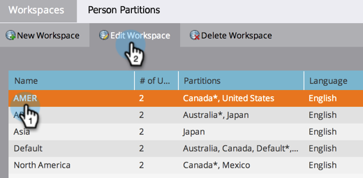
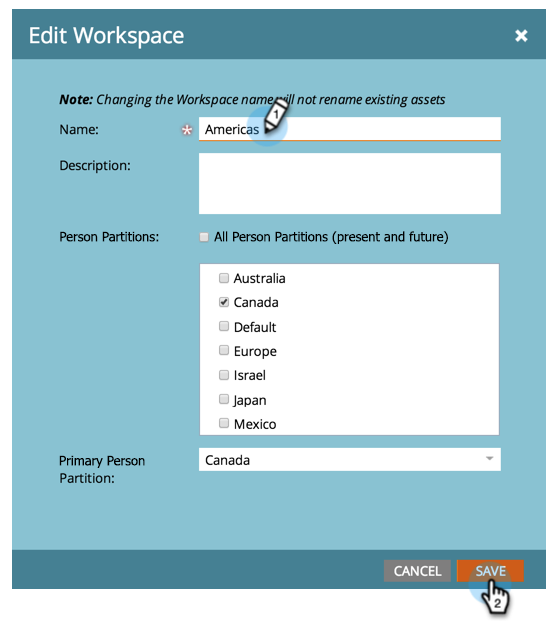

# 更改工作区名称 {#change-the-name-of-a-workspace}

>[!NOTE]
>
>**需要管理员权限**

>[!PREREQUISITES]
>
>[创建新的Workspace](/help/marketo/product-docs/administration/workspaces-and-person-partitions/create-a-new-workspace.md)

用户可以更改工作区的名称。 这相当简单。

>[!NOTE]
>
>首先了解[了解工作区和人员分区](/help/marketo/product-docs/administration/workspaces-and-person-partitions/understanding-workspaces-and-person-partitions.md)。

1. 进入 **[!UICONTROL Admin]** 区域。

   

1. 单击 **[!UICONTROL Workspaces & Partitions]**。

   

1. 选择Workspace并单击&#x200B;**[!UICONTROL Edit Workspace]**。

   

1. 为您的Workspace输入新的&#x200B;**[!UICONTROL Name]**&#x200B;并单击&#x200B;**[!UICONTROL Save]**。

   

保存后，您应该会看到所做的更改。

