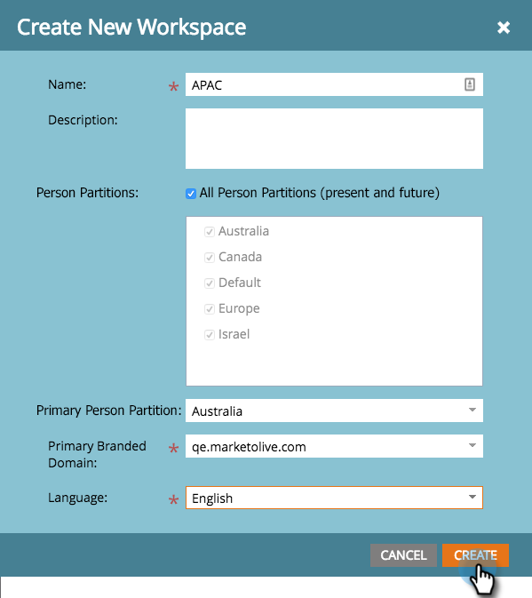

# 创建新工作区 {#create-a-new-workspace}

工作区可用于细分您的公司。 设置工作区的原因包括：

* 地理位置：欧洲营销运营与北美营销运营
* 业务单位A与业务单位B

以下是如何创建新工作区。

>[!NOTE]
>
>**需要管理员权限**

>[!NOTE]
>
>首先了解 [了解工作区和人员分区](/help/marketo/product-docs/administration/workspaces-and-person-partitions/understanding-workspaces-and-person-partitions.md){target="_blank"}.

>[!TIP]
>
>要了解有关Workspace最佳实践的更多信息，请联系 [Marketo专业服务](https://business.adobe.com/products/marketo/services-support.html){target="_blank"}.

1. 转到 **[!UICONTROL 管理员]** 区域。

   

1. 单击 **[!UICONTROL 工作区和分区]**.

   

1. 单击 **[!UICONTROL 新建工作区]**.

   

1. 输入 **[!UICONTROL 名称]**，并选择 **[!UICONTROL 人员分区]** 您想要使用。 选择 **[!UICONTROL 主要人员分区]**. 确保 [创建人员分区](/help/marketo/product-docs/administration/workspaces-and-person-partitions/create-a-person-partition.md){target="_blank"} 如果你还没有的话。

   

   >[!NOTE]
   >
   >* 此 **[!UICONTROL 所有人员分区]** 复选框表示此工作区可以使用系统中的所有人员分区。
   >
   >* 此 **[!UICONTROL 主要人员分区]** 充当默认设置，并且是分配所有人员的位置。

   >[!IMPORTANT]
   >
   >如果启用了多个品牌域，则必须选择一个主品牌域。

1. 选择工作区语言。

   

   >[!NOTE]
   >
   >创建后，Marketo将在工作区中植入示例资源。 语言允许这些系统初始对象使用非英语语言。

1. 单击&#x200B;**[!UICONTROL 创建]**。

   

根据需要创建任意数量的工作区，并为其分配适当的人员分区。

创建工作区后，您应会看到更新。

