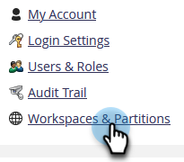
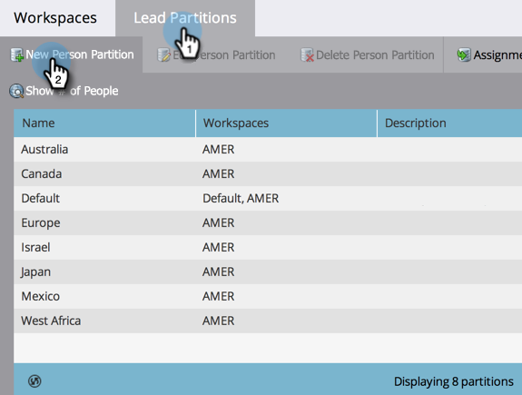
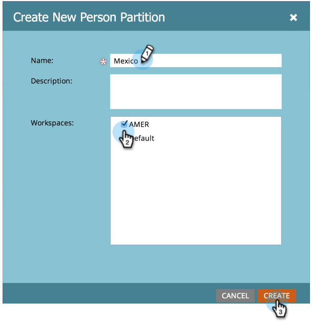

# 创建人员分区 {#create-a-person-partition}

按照以下步骤创建新的人员分区。

>[!NOTE]
>
>**需要管理员权限**

>[!NOTE]
>
>有关详细信息，请参阅[了解工作区和人员分区](/help/marketo/product-docs/administration/workspaces-and-person-partitions/understanding-workspaces-and-person-partitions.md)。

1. 进入 **[!UICONTROL Admin]** 区域。

   

1. 单击 **[!UICONTROL Workspaces & Partitions]**。

   

1. 转到&#x200B;**[!UICONTROL Person Partitions]**&#x200B;选项卡并单击&#x200B;**[!UICONTROL New Person Partition]**。

   

1. 命名分区，选择要显示分区的&#x200B;**[!UICONTROL Workspaces]**，然后单击&#x200B;**[!UICONTROL Create]**。

   

创建分区后，您应该会看到更新。

