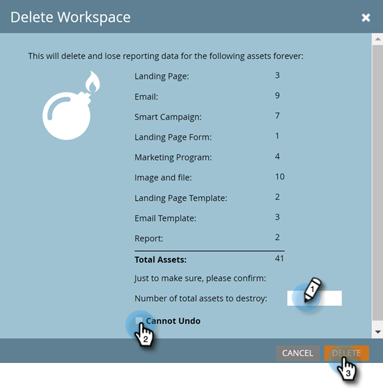

# 删除工作区 {#delete-a-workspace}

>[!NOTE]
>
>**需要管理员权限**

>[!NOTE]
>
>您无法删除Marketo中的默认工作区。

1. 在“管理员”下，单击 **工作区和分区**.

   

1. 选择工作区并单击 **删除工作区**.

   

1. 确认要删除的资产数量（它列在“总资产”旁边），选择 **无法撤消** 复选框，然后单击 **删除**.

   
