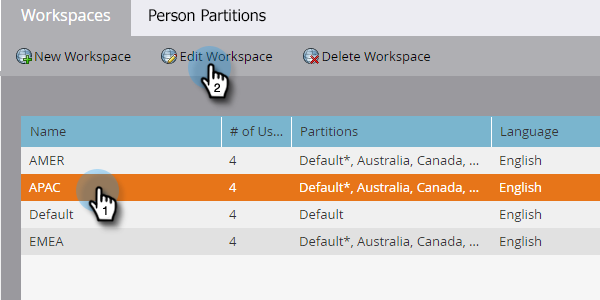

# 编辑工作区 {#edit-a-workspace}

有时，您需要在Workspace中进行更改。 这很容易。

>[!NOTE]
>
>**需要管理员权限**

>[!NOTE]
>
>使用对工作区进行向上笔刷 [了解工作区和人员分区](/help/marketo/product-docs/administration/workspaces-and-person-partitions/understanding-workspaces-and-person-partitions.md){target="_blank"}.

1. 转到 **[!UICONTROL 管理员]** 区域。

   

1. 单击 **[!UICONTROL 工作区和分区]**.

   

1. 选择要编辑的工作区，然后单击 **[!UICONTROL 编辑工作区]**.

   

1. 您可以选择不同的潜在客户分区，然后从下拉列表中选择不同的主要人员分区。

   >[!NOTE]
   >
   >您可以 [创建更多人员分区](/help/marketo/product-docs/administration/workspaces-and-person-partitions/create-a-person-partition.md){target="_blank"} 如果你需要的话。

   

   >[!NOTE]
   >
   >此 **[!UICONTROL 所有人员分区]** 复选框表示此工作区可以使用系统中的所有潜在客户分区。

   >[!NOTE]
   >
   >此 **[!UICONTROL 主要人员分区]** 充当默认设置，并且是分配所有人员的位置。

   如果启用了多个品牌域，则可以更改为其他主品牌域。 单击 **[!UICONTROL 保存]**.

   

   >[!NOTE]
   >
   >您无法更改工作区语言。

>[!MORELIKETHIS]
>
>* [创建新工作区](/help/marketo/product-docs/administration/workspaces-and-person-partitions/create-a-new-workspace.md){target="_blank"}
>* [了解工作区和人员分区](/help/marketo/product-docs/administration/workspaces-and-person-partitions/understanding-workspaces-and-person-partitions.md){target="_blank"}
