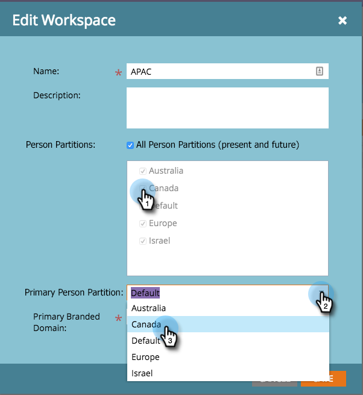

# 编辑工作区{#edit-a-workspace}

有时，您需要在工作区中进行更改。 很简单。

>[!NOTE]
>
>**需要管理权限**

>[!NOTE]
>
>使用[了解工作区和人员分区](/help/marketo/product-docs/administration/workspaces-and-person-partitions/understanding-workspaces-and-person-partitions.md)对工作区进行刷新。

1. 在&#x200B;**Admin**&#x200B;下，单击&#x200B;**工作区和分区**。

   

1. 选择要编辑的工作区，然后单击&#x200B;**编辑工作区**。

   

1. 您可以选择其他潜在客户分区，并从下拉列表中选择其他主要人员分区。

   >[!NOTE]
   >
   >如果需要，您可以[创建更多人员分区](/help/marketo/product-docs/administration/workspaces-and-person-partitions/create-a-person-partition.md)。

   

   >[!NOTE]
   >
   >**所有人分区**&#x200B;复选框表示此工作区可以使用系统中的所有潜在客户分区。

   >[!NOTE]
   >
   >**主要人员分区**&#x200B;用作默认值，所有人员都将分配到该分区。

   如果您启用了多个品牌域，则可以更改为其他主品牌域。 单击&#x200B;**保存**。

   

   >[!NOTE]
   >
   >无法更改工作区语言。

>[!MORELIKETHIS]
>
>* [创建新工作区](/help/marketo/product-docs/administration/workspaces-and-person-partitions/create-a-new-workspace.md)
>* [了解工作区和人员分区](/help/marketo/product-docs/administration/workspaces-and-person-partitions/understanding-workspaces-and-person-partitions.md)

