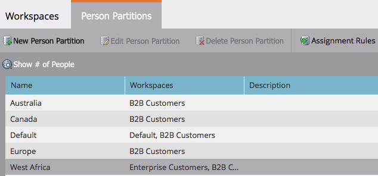

# 编辑现有人员分区{#edit-an-existing-person-partition}

人分区就像拥有第二（或第三）数据库。 分区可连接到一个或多个工作区。 下面介绍如何编辑分区详细信息。

>[!NOTE]
>
>**需要管理权限**

>[!PREREQUISITES]
>
>[创建人员分区](/help/marketo/product-docs/administration/workspaces-and-person-partitions/create-a-person-partition.md)

1. 在&#x200B;**Admin**&#x200B;下，单击&#x200B;**工作区和分区**。

   

1. 在&#x200B;**人员分区**&#x200B;选项卡下，选择要编辑的人员分区，然后单击&#x200B;**编辑人员分区**。

   

1. 输入人员分区&#x200B;**名称**、其所属的&#x200B;**工作区**，然后单击&#x200B;**保存**。

   

1. 保存更改后，您应看到更新！

   

就这样。 这似乎是一个强大的功能应该很复杂，但它并不复杂。

>[!CAUTION]
>
>测量两次，剪切一次。 您不希望将分区分配到错误的工作区。
