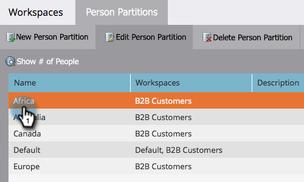

# 编辑现有人员分区 {#edit-an-existing-person-partition}

人员分区就像拥有第二个（或第三个）数据库。 分区可以挂接到一个或多个工作区。 下面是如何编辑分区详细信息。

>[!NOTE]
>
>**需要管理员权限**

>[!PREREQUISITES]
>
>[创建人员分区](/help/marketo/product-docs/administration/workspaces-and-person-partitions/create-a-person-partition.md){target="_blank"}

1. 转到 **[!UICONTROL 管理员]** 区域。

   

1. 单击 **[!UICONTROL 工作区和分区]**.

   

1. 在 **[!UICONTROL 人员分区]** 选项卡，选择要编辑的人员分区，然后单击 **[!UICONTROL 编辑人员分区]**.

   

1. 输入人员分区 **[!UICONTROL 名称]**，则 **[!UICONTROL 工作区]** 它们属于，然后单击 **[!UICONTROL 保存]**.

   

保存更改后，您应会看到更新！

