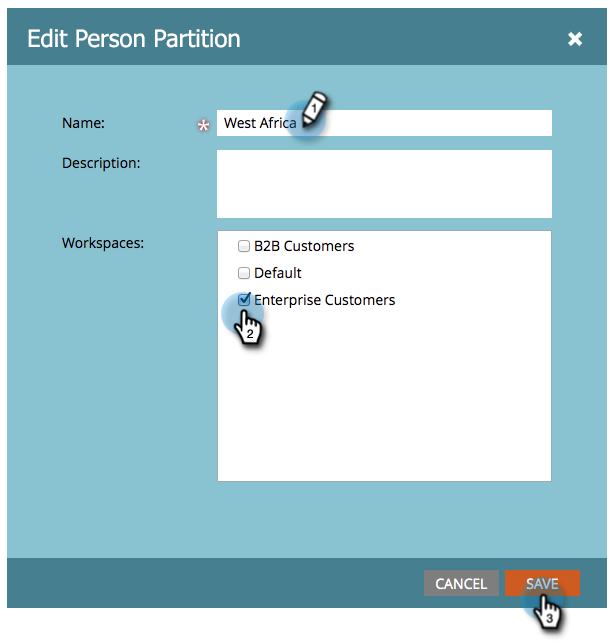

# 编辑现有人员分区 {#edit-an-existing-person-partition}

人员分区就像有第二（或第三）数据库。 可以将分区挂接到一个或多个工作区。 以下是如何编辑分区详细信息。

>[!NOTE]
>
>**需要管理员权限**

>[!PREREQUISITES]
>
>[创建人员分区](/help/marketo/product-docs/administration/workspaces-and-person-partitions/create-a-person-partition.md)

1. 转到 **管理员** 的上界。

   

1. 单击 **工作区和分区**.

   

1. 在 **人员分区** 选项卡，选择要编辑的人员分区并单击 **编辑人员分区**.

   

1. 输入人员分区 **名称**, **工作区** 属于，然后单击 **保存**.

   

1. 保存更改后，您应会看到更新！

   
