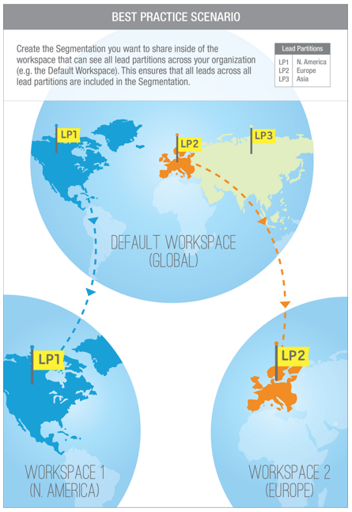

# 跨工作区和分区共享分段 {#share-segmentations-across-workspaces-and-partitions}

>[!PREREQUISITES]
>
>本文仅适用于拥有工作区和分区的客户。

## 什么是分段？ {#whats-a-segmentation}

Marketo非常善于为项目或明智的营销活动挑选合适的人员。 但是，对于更永久的角色，您应使用分段。 在Marketo中使用高级动态内容时需要这些权限。

>[!NOTE]
>
>了解[如何创建分段](/help/marketo/product-docs/personalization/segmentation-and-snippets/segmentation/create-a-segmentation.md)。

设置这些角色（_和_&#x200B;使用工作区）后，您将在工作区之间共享它们。 以下是一些需要了解的好事情：

## 规则和提示 {#rules-tips}

* 每个Marketo订阅最多可以包含跨多个工作区的20个分段“总计”（**不是每个工作区** 20个）。
* 您只能与您有权访问的工作区共享分段。
* 确保创建并利用对所有分区&#x200B;**具有可见性的**&#x200B;默认工作区。

* 分段处理仅对创建分段的工作区中的人员运行。

   * 创建要在默认Workspace中共享的分段。
      * 批准分段
      * 共享工作区将看到一个锁定的文件夹，并且分段为只读。
      * 无法编辑共享版本。 您只能编辑创建它的原始分段。

   * 当您单击共享区段中的区段（例如，医疗保健）时，您看到的人员将只是与正在查看的工作区相关联的分区中的人员。
      * 如果在Workspace 1 (WS1)中创建分段并将其与WS2共享，并且WS1无权访问WS2的分区，则不会重新计算分段。
      * 如果在具有有限分区的工作区中创建分段，然后将其与另一个工作区共享，则接收共享分段的工作区将仅看到重叠的人员。

>[!NOTE]
>
>有些规则有点复杂。 最简单的入门方法是与特定人员一起进行测试。 您始终可以生成新的分段并删除旧的分段。

## 示例场景 {#example-scenarios}

## 共享分段 {#share-a-segmentation}

1. 转到&#x200B;**[!UICONTROL Database]**。

   

1. 右键单击&#x200B;**[!UICONTROL Segmentations]**&#x200B;并选择&#x200B;**[!UICONTROL New Folder]**。

   

1. 命名要在工作区之间共享的文件夹（例如：共享分段），然后单击&#x200B;**[!UICONTROL Create]**。

   

1. 将要共享的分段移动到文件夹中。

   

1. 右键单击该文件夹并选择&#x200B;**[!UICONTROL Share Folder]**。

   

1. 选择要与其共享文件夹的工作区。 单击 **[!UICONTROL Save]**。

   

   >[!NOTE]
   >
   >该对话框会显示您有权查看的工作区，正因如此，Marketo建议从默认工作区中创建并共享显示所有工作区和分区的区段。

源文件夹显示在数据库树中，其箭头指示它与其他工作区共享。 在共享工作区中，文件夹显示时带有锁，表示文件夹的内容已从另一个工作区共享，并且是只读的。
