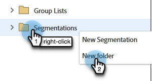

# 在工作区和分区之间共享区段 {#share-segmentations-across-workspaces-and-partitions}

>[!PREREQUISITES]
>
>本文仅适用于具有工作区和分区的客户。

## 什么是分段？ {#whats-a-segmentation}

Marketo擅长挑选适合自己的项目或智能营销活动的人才。 但是，对于更永久的角色，您应使用分段。 需要在Marketo中使用高级动态内容。

>[!NOTE]
>
>学习 [如何创建区段](/help/marketo/product-docs/personalization/segmentation-and-snippets/segmentation/create-a-segmentation.md).

设置这些角色后(_和_ 使用工作区)，则需要在工作区中共享它们。 以下是一些好事要知道：

## 规则和提示 {#rules-tips}

* 每个Marketo订阅最多可包含20个跨多个工作区的分段（“总计”）(**每个工作区不是20个**)。
* 您只能与您有权访问的工作区共享分段。
* 确保创建和利用 **可查看所有分区的默认工作区**.

* 分段处理仅在创建分段的工作区中的人员上运行。

   * 创建要在默认工作区内共享的分段。
      * 批准分段
      * 共享工作区会看到锁定的文件夹，并且区段为只读。
      * 无法编辑共享版本。 您只能编辑创建原始分段的位置。
   * 当您单击共享区段中的区段（例如医疗保健）时，您看到的人员将只是分区中与您正在查看的工作区相关联的人员。
      * 如果在工作区1(WS1)中创建分段并将其与WS2共享，且WS1无权访问WS2的分区，它将不会重新计算分段。
      * 如果您在具有有限分区的工作区中创建分段，然后将其与其他工作区共享，则收到共享分段的工作区将仅在人员重叠时才会看到人员。

>[!NOTE]
>
>这些规则中有些复杂。 最简单的入门方法是对特定人员进行测试。 您始终可以进行新分段并删除旧分段。

## 示例方案 {#example-scenarios}

## 共享区段 {#share-a-segmentation}

1. 转到 **数据库**.

   

1. 右键单击 **分段** 选择 **新建文件夹**.

   

1. 命名要在工作区中共享的文件夹(例如：共享区段)，然后单击 **创建**.

   

1. 将您要共享的分段移入文件夹。

   

1. 右键单击文件夹并选择 **共享文件夹**.

   

1. 选择要与其共享文件夹的工作区。 单击 **保存**.

   

   >[!NOTE]
   >
   >该对话框显示您有权查看的工作区，这就是Marketo建议从可查看所有工作区和分区的默认工作区创建和共享区段的原因。

原始文件夹显示在数据库树中，并带有一个箭头，指示已与其他工作区共享该文件夹。 在共享工作区中，文件夹会显示一个锁，指示已从其他工作区共享文件夹的内容为只读。
