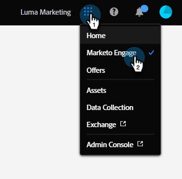

# Adobe Experience Cloud 界面概述 {#adobe-experience-cloud-interface-overview}

Adobe Experience Cloud 界面在外观和体验上与 Adobe Experience Cloud 的应用程序与服务保持一致。 但是，它不仅仅是一种新设计。 它是一个单页应用程序，可在单个实例中提供用户体验。

## 用户流程 {#user-flow}

如果您尚未登录Adobe Experience Cloud产品，请在此处直接登录[!DNL Marketo Engage]： [https://experience.adobe.com/marketo-engage](https://experience.adobe.com/marketo-engage)。

如果您&#x200B;_是_&#x200B;已登录Adobe Experience Cloud产品，请单击菜单图标并选择&#x200B;**[!DNL Marketo Engage]**。

>[!NOTE]
>
>您的下拉菜单可能会因您订阅的Adobe Experience Cloud产品而异。

## 新增功能 {#new-features}

除了更新的外观和感觉外，还提供以下功能：

**集成帮助中心**

可直接在 [!DNL Marketo Engage] 应用程序内访问多种可用的帮助资源。

**应用程序切换器**

拥有多个 Adobe 产品访问权限的用户可轻松在不同产品之间切换。

**通知和公告**

您还可以在应用程序内直接查看并互动处理与产品相关的通知，以及 Adobe 产品的通用公告。

**Adobe 设置**

单击您的轮廓图标以更改语言或其他适用于整个 Adobe 的偏好设置。

## 常见问题解答 {#faq}

**我无法通过Experience Cloud界面登录到[!DNL Marketo Engage]。 可能存在什么问题？**

如果您可以登录 Adobe Experience Cloud，但随后出现“页面加载失败”错误，则问题可能出在 [!DNL Marketo Engage] 端。 请联系[Marketo支持](https://nation.marketo.com/t5/support/ct-p/Support)以获取帮助。

**用户历史记录、全局搜索、Marketo 通知和任务栏到哪里去了？**

这些功能已从顶部导航移至 Experience Cloud 界面左侧的新工具栏中。

