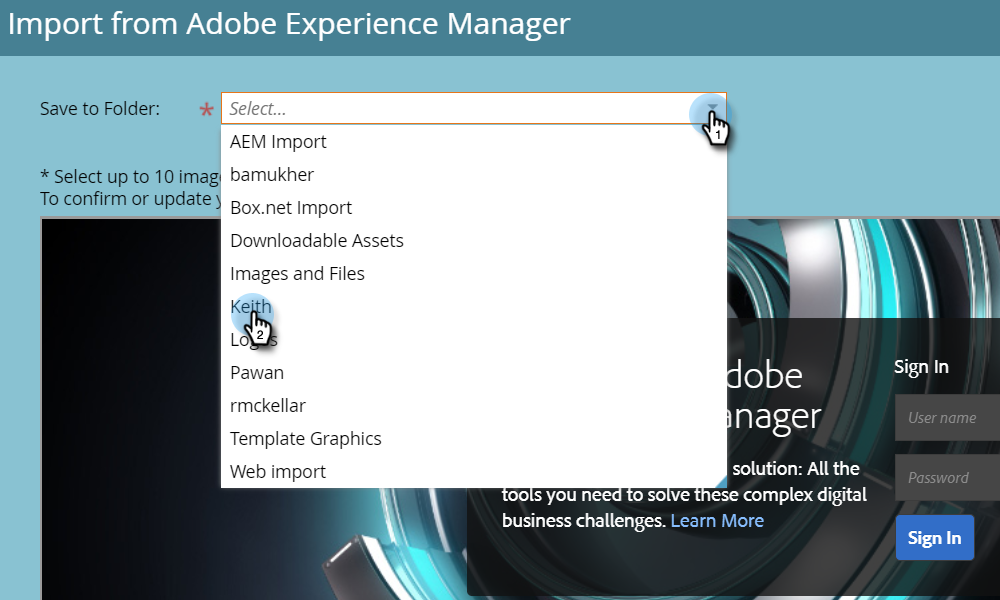

# 使用 Adobe Experience Manager 导入资源 {#importing-assets-with-adobe-experience-manager}

资产选择器允许Marketo客户访问、选择AEM资产，并将其导入Marketo [!DNL Design Studio]。 **需要管理员权限**。

>[!AVAILABILITY]
>
>并非每个人都购买了此功能。 有关详细信息，请联系Adobe客户团队（您的客户经理）。

>[!PREREQUISITES]
>
>确保已执行[AEM配置](/help/marketo/product-docs/core-marketo-concepts/miscellaneous/configuring-adobe-experience-manager-integration.md)。

>[!IMPORTANT]
>
>当前，[!DNL Firefox]中完全支持此功能。 [!DNL Safari]不支持它，并且它可能在[!DNL Chrome]的最新版本中不起作用，具体取决于您的[!DNL SameSite] Cookie设置。

1. 单击 **[!UICONTROL Design Studio]**。

   

1. 单击“新建”下拉菜单并选择&#x200B;**[!UICONTROL Import from Adobe Experience Manager]**。

   

1. 选择图像将保存到的文件夹。

   

1. 登录到Adobe Experience Manager（如果尚未登录）。

   

1. 选择您的文件夹。 然后，通过单击缩略图选择所需的图像（最多可选择10张）。 完成后，单击 **[!UICONTROL Select]**。

   

   >[!NOTE]
   >
   >图像大小不能超过100MB。

1. 单击&#x200B;**[!UICONTROL Import]**&#x200B;以完成该过程。

   

   单击&#x200B;**[!UICONTROL Close]**&#x200B;以返回设计工作室。

   

## 注意事项 {#things-to-note}

* Marketo当前支持Adobe Experience Manager版本6.4和6.5。

* 实例中的所有用户都将能够查看和访问您导入的图像。

* 图像不会自动更新。 如果导入到Marketo [!DNL Design Studio]中的图像在AEM中更新，则必须手动将其重新导入到Marketo中。
