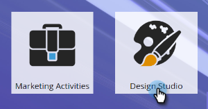

# 使用Adobe Experience Manager导入资源 {#importing-assets-with-adobe-experience-manager}

资产选择器允许Marketo客户访问、选择AEM资产，并将其导入Marketo [!DNL Design Studio]. **需要管理员权限**.

>[!AVAILABILITY]
>
>并非每个人都购买了此功能。 有关详细信息，请联系Adobe客户团队（您的客户经理）。

>[!PREREQUISITES]
>
>确保您已执行 [AEM配置](/help/marketo/product-docs/core-marketo-concepts/miscellaneous/configuring-adobe-experience-manager-integration.md).

>[!IMPORTANT]
>
>目前，仅完全支持此功能 [!DNL Firefox]. 不支持它 [!DNL Safari]，并且它可能在最新版本的 [!DNL Chrome]，具体取决于您的 [!DNL SameSite] Cookie设置。

1. 单击 **[!UICONTROL Design Studio]**.

   

1. 单击新建下拉列表，然后选择 **[!UICONTROL 从Adobe Experience Manager导入]**.

   

1. 选择图像将保存到的文件夹。

   

1. 登录到Adobe Experience Manager（如果尚未登录）。

   

1. 选择您的文件夹。 然后，通过单击缩略图选择所需的图像（最多可选择10张）。 单击 **[!UICONTROL 选择]** 完成时。

   

   >[!NOTE]
   >
   >图像大小不能超过100MB。

1. 单击 **[!UICONTROL 导入]** 以完成该过程。

   

   就是这样！ 单击 **[!UICONTROL 关闭]** 以返回设计工作室。

   

## 注意事项 {#things-to-note}

* Marketo当前支持Adobe Experience Manager版本6.4和6.5。

* 实例中的所有用户都将能够查看/访问您导入的图像。

* 图像不会自动更新。 如果图像已导入到Marketo [!DNL Design Studio] 已在AEM中更新，您必须手动将其重新导入Marketo。
