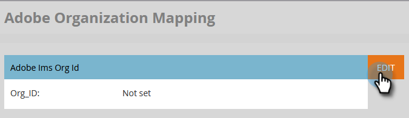

# 设置Adobe组织映射 {#set-up-adobe-organization-mapping}

要与Adobe应用程序(如Audience Manager、B2B CDP Marketo连接器、Dynamic Chat等)同步，您必须先在Marketo中输入Adobe IMS组织凭据。

>[!NOTE]
>
>Marketo实例的HIPAA就绪部署无法使用此集成。

>[!CAUTION]
>
>对于已载入Adobe业务平台和Identity Management系统的客户，将与订阅关联的组织ID将已填充，并且是只读字段。

1. 在Marketo中，单击 **管理员**.

   

1. 在集成下，单击 **Adobe组织映射**.

   

1. 单击 **编辑**.

   

1. 输入您的Adobe IMS组织ID(了解如何查找 [此处](https://experienceleague.adobe.com/docs/control-panel/using/faq.html))并单击 **确定**.

   

1. 单击 **确认**.

   

1. 单击 **关闭**.

   

   >[!IMPORTANT]
   >
   >出于安全考虑，您必须是要映射到的Adobe组织的组织管理员。 如果不是，操作将失败。 此外，Adobe用户和Marketo用户在登录时必须使用相同的电子邮件地址。

1. 如果您 _not_ 已登录，则新选项卡/窗口中将显示一个弹出窗口。 登录到您的Adobe组织（此操作将验证组织访问权限）。

就这样！ 您现在可以 [共享受众数据](/help/marketo/product-docs/core-marketo-concepts/smart-lists-and-static-lists/static-lists/send-a-list-to-adobe-experience-cloud.md){target=&quot;_blank&quot;}改为，或 [同步受众](/help/marketo/product-docs/adobe-experience-cloud-integrations/sync-an-audience-from-adobe-experience-cloud.md)来自Adobe Experience Cloud的{target=&quot;_blank&quot;}。
