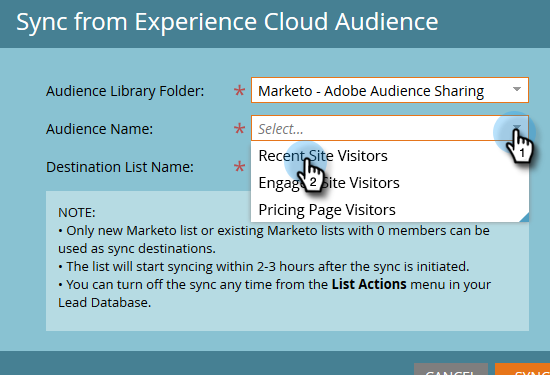

# 从 Adobe Experience Cloud 同步受众 {#sync-an-audience-from-adobe-experience-cloud}

>[!NOTE]
>
>Marketo实例的适用于HIPAA的部署无法使用此集成。

>[!PREREQUISITES]
>
>[设置Adobe组织映射](/help/marketo/product-docs/adobe-experience-cloud-integrations/set-up-adobe-organization-mapping.md){target="_blank"}

## 如何同步受众 {#how-to-sync-an-audience}

1. 在“我的Marketo”中，单击&#x200B;**[!UICONTROL Database]**&#x200B;磁贴。

   

1. 点击 **[!UICONTROL New]** 下拉菜单，并选择 **[!UICONTROL Sync from Experience Cloud Audience]**。

   

1. 单击&#x200B;**[!UICONTROL Audience Library Folder]**&#x200B;下拉列表并选择所需的原始文件夹。

   

1. 选择&#x200B;**[!UICONTROL Audience Name]**。

   

1. 对于目标，您可以选择现有列表，也可以键入新列表的名称。 在本例中，我们将创建一个新版本。 完成后单击&#x200B;**[!UICONTROL Sync]**。

   

1. 单击 **[!UICONTROL OK]**。

   

## 常见问题解答 {#faq}

**Cookie同步如何工作？**

为您的Marketo订阅启用Cookie同步后，Marketo的munchkin.js会尝试为您在集成设置期间指定的Adobe IMS组织捕获和存储Adobe ECID，并将这些ECID与相应的Marketo Cookie标识符进行匹配。 这使得Marketo的匿名用户配置文件能够丰富到Adobe ECID。

还需要执行进一步的步骤，以将匿名用户配置文件与潜在客户配置文件相关联，该潜在客户配置文件使用纯文本电子邮件进行标识。 此处介绍了[的工作方式](/help/marketo/product-docs/reporting/basic-reporting/report-activity/tracking-anonymous-activity-and-people.md){target="_blank"}。

**为什么Marketo中的列表大小与Adobe中的列表大小不同？**

如果我们无法将ECID Cookie ID绑定到Marketo中的已知人员，则人员也不会进行同步。

**这是一次性同步吗？**

您只需启动同步一次。 之后，记录将自动同步。 初始同步最多可能需要24小时；以后，新记录将在2-3小时内同步。
