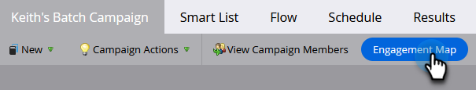

# 参与度图概述 {#engagement-map-overview}

参与度图允许您借助直观的可视化图表构建可重复使用的Smart Campaigns 。 它提供了与所有现有Marketo Engage智能营销活动的完全向后兼容性，并且不会丢失任何当前功能。

>[!NOTE]
>
>参与度映射当前在Smart Campaigns中可用。 它在“程序”中不可用。

## 访问参与图 {#accessing-engagement-map}

导航到任何现有营销策划，然后单击 **参与图** 按钮。

在参与度图中，您将看到两个选项卡： [参与图](/help/marketo/product-docs/core-marketo-concepts/engagement-map/engagement-map-tab.md){target="_blank"} and [Settings](/help/marketo/product-docs/core-marketo-concepts/engagement-map/settings-tab.md){target="_blank"}.

## 信息卡描述 {#card-descriptions}

**触发器**：在包含触发器的营销活动中，映射将具有“触发器概述”信息卡。 单击此选项将显示每个触发器的卡片，以及包含其他信息的滑出面板。

**过滤器**：在包含过滤器的营销活动中，映射将包含对应于每个过滤器的信息卡。 单击它们将显示一个包含其他信息的滑出面板。

**流程步骤**：每个营销活动都将包含用于每个流量步骤的信息卡。 单击它们将显示一个包含其他信息的滑出面板。

**选项**：如果流程步骤包含一个或多个选项，则单击流程卡将显示每个选项的卡片，以及包含其他信息的滑出面板。

## 嵌套式营销活动 {#nested-campaigns}

* 如果营销活动包括“请求”或“执行营销活动”流程步骤，则单击流程卡将显示所调用营销活动的详细信息，以及包含其他信息的滑出面板。

* 如果促销活动包含包含包含选项的“请求”或“执行促销活动”流程步骤，则单击流程卡将显示选项卡以及滑出面板，其中提供有关选项的更多信息。 单击每个选择卡片将显示所调用营销活动的详细信息，以及包含更多信息的滑出面板。

* 此外，如果任何嵌套营销活动具有“请求”或“执行营销活动”流量步骤，则单击流量卡将显示营销活动的详细信息。 当流程步骤包含选项时，同样适用。

## 顶部导航 {#top-navigation}

顶部导航包含以下功能：

* 营销活动名称以及对“编辑营销活动”模式访问权限，您可以在此处编辑营销活动名称和描述。

* 营销活动状态和营销活动类型将反映在营销活动名称下方

* 用于触发营销活动的“激活”/“停用”按钮

* 编辑智能列表 — 您将在新选项卡中导航到智能列表界面，您可以在其中添加或编辑智能列表

* 编辑流量 — 您将在新选项卡中被导航到流量界面，您可以在其中添加或编辑智能列表

* 导出 — 这将下载营销活动可视化图表的图像。 下载的版本将反映您扩展的任何分支

* 查看营销活动成员 — 这将打开一个包含营销活动成员详细信息的新选项卡。

>[!NOTE]
>
>在打开的“智能列表”和“流量”选项卡中所做的更改将在刷新时反映在“参与图”选项卡中。 它不会自动更新。 将显示自动保存的更新和编辑。

## 常见问题解答 {#faq}

**我是否必须在参与度图中重建所有营销活动？**

否. 参与图具有完全向后兼容性。 通过单击按钮，您可以在可视化参与度图界面中查看每个现有营销活动。

**Marketo Engage中具有参与度映射是否意味着我将失去对文件夹结构的访问权限，并且必须重新学习如何构建Smart Campaign？**

否. 参与度图的好处在于，它可以让您做到两全其美；它是当前构建营销活动的方式的补充。 您可以选择使用现有UI，还是在新UI中构建/可视化图表。 所有用户仍可获得Marketo Engage的强大功能集，该功能集现在由可视化创建工具进行补充。

**参与度映射是否为付费加载项？**

否. 所有订阅下的所有现有和新Marketo Engage用户都将有权访问此免费功能。

**作为Marketo Engage管理员，我是否负责打开/关闭参与图？**

否. 参与度映射将适用于其实例中的所有用户。 您将无法为某些用户、工作区等打开/关闭此功能。

**当前在智能营销活动中可用的所有功能是否也可在参与度图中找到？**

是. 参与度图与Smart Campaigns具有完全的功能对等性。

**这与其他可视化生成器有何不同？**

有三个关键因素区分了参与图：

* 灵活性：通过可视化轻松管理和验证互连或深度嵌套的营销活动。

* 功能：所有可视化图表都开箱即用，因此更易于使用；嵌套结构允许您深入查看并获取整张图片。

* 幂：您可以保留所有现有的Marketo Engage复杂程度，现在以可视化形式显示。

>[!MORELIKETHIS]
>
>* [“参与图”选项卡](/help/marketo/product-docs/core-marketo-concepts/engagement-map/engagement-map-tab.md){target="_blank"}
>* [“设置”选项卡](/help/marketo/product-docs/core-marketo-concepts/engagement-map/settings-tab.md){target="_blank"}
