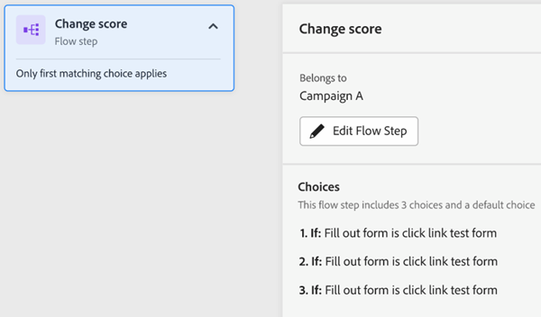

# “参与图”选项卡 {#engagement-map-tab}

参与度图通过一系列触发器、过滤器和流量卡表示。 单击每个卡片将显示其他信息。

触发器概述：此信息卡显示促销活动中的触发器数量。 单击此图标将显示每个触发器的卡片，以及包含以下信息的滑出面板：

* 触发器所属的营销活动
* 触发器名称列表
* “编辑触发器”按钮

  

触发器详细信息：此信息卡显示触发器名称。 单击此图标将显示一个滑出面板，其中包含以下信息：

* 触发器所属的营销活动
* 与触发器关联的约束列表
* “编辑触发器”按钮

  

筛选器：单击此卡片将显示一个弹出面板，其中显示以下信息：

* 触发器所属的营销活动
* 符合筛选条件的估计人数
* 筛选器及其相应限制的列表
* “编辑筛选器”按钮

  

流程步骤：如果流程步骤包含选项，则此信息卡将显示流程步骤的名称。 单击此图标将显示一个滑出面板，其中包含以下信息：

* 流量步骤所属的活动
* 与流程步骤关联的选择条件列表
* “编辑流量”按钮

  

流程步骤：如果流程步骤可以 _非_ 包括任何选项，此信息卡将显示与流程步骤关联的属性。 单击此图标将显示一个滑出面板，其中包含以下信息：

* 流量步骤所属的活动
* 与流程步骤关联的属性列表
* “编辑流量”按钮

  

## 执行和请求营销活动的流程步骤 {#flow-step-for-execute-and-request-campaigns}

* 如果执行或请求营销活动流程步骤不包含任何选项，则信息卡将显示营销活动的名称。 单击卡片将显示一个弹出面板，其中包含以下信息：

   * 流程步骤所属的活动
   * “编辑流量”按钮
   * 与流程步骤关联的属性列表
   * “查看列表”按钮，这将打开使用特定请求/执行营销活动的营销活动列表

>[!NOTE]
>
>您可以编辑主营销策划中的流量步骤。 要编辑嵌套营销活动，您必须通过滑出面板中的链接导航到该营销活动。

* 如果“执行”或“请求营销活动”流程步骤包含选项，则信息卡将显示营销活动的名称。 单击卡片将显示一个弹出面板，其中包含以下信息：

   * 流程步骤所属的活动
   * 与流程步骤关联的选择条件列表
   * “编辑流量”按钮

  

  

* 如果执行或请求营销活动包含选项，则单击流量卡片将会展开并显示各个卡片中的所有选项。 单击选择卡将展开与特定选择关联的营销策划，并显示一个包含以下信息的滑出面板：

   * 选择所属的营销活动
   * “编辑选项”按钮
   * 与流程步骤关联的选择条件列表
   * “查看列表”按钮，这将打开使用特定请求/执行营销活动的营销活动列表

  

## 可视化嵌套的执行活动 {#visualizing-a-nested-execute-campaign}

执行与父营销活动系列运行的营销活动。 符合可执行营销活动资格的人完成该营销活动的所有流程步骤并返回主营销活动以继续完成此营销活动的流程步骤。

以下是智能营销活动“营销活动A”的示例，其中包括执行营销活动流程步骤。 将“营销活动A”视为您的主要营销活动。

1. 单击执行营销活动流量卡会展开以显示“营销活动B”的详细信息。
1. “营销活动B”包括将受众拆分为两个组的过滤器：合格受众和未合格受众。
1. 符合条件的受众将执行与“营销活动B”相关的流程步骤。
1. 所有受众（符合条件且非符合条件）将返回到“营销活动A”并进入下一个流程步骤。

   

您可以单击“促销活动B”中的“执行促销活动”流程步骤，该步骤将展开以显示与每个选择关联的选择卡和促销活动。

## 可视化请求营销活动 {#visualizing-request-campaign}

请求营销活动与父营销活动并行运行。 符合请求营销活动资格的人完成来自营销活动的所有流程步骤，然后退出营销活动。 同时，同一组人员会经历主营销策划的流程步骤。

以下是智能营销活动“营销活动A”的示例，其中包括请求营销活动流程步骤。 将“营销活动A”视为您的主要营销活动。

1. 单击请求营销活动流量卡将展开以显示“营销活动B”的详细信息
1. “营销活动B”包括将受众拆分为两个组的过滤器：合格受众和未合格受众。
1. 符合条件的受众将执行与“营销活动B”相关的流程步骤。
1. 同时，所有受众将转移到“促销活动A”中的下一个流程步骤。

   

如果任何流量步骤包含其他请求营销活动，您可以深入了解嵌套营销活动，方法是单击流量卡查看营销活动的详细信息。

以下是包含选项的请求营销活动的示例。

## 错误处理 {#error-handling}

智能列表和流程步骤中的错误将通过信息卡中的错误图标突出显示。 此外，相应的错误消息将反映在滑出面板中。

以下是触发器中的错误示例，该示例显示在触发器概述信息卡、滑出面板和详细信息触发器信息卡中。

**过滤器卡片中的错误可能包括：**

* 智能列表中发生错误，导致无法显示符合条件的受众

* 筛选器逻辑中有错误

* 一个或多个过滤器中的约束（或缺少约束）出错

  

>[!NOTE]
>
>在单击展开嵌套营销活动之前，不会显示嵌套营销活动中的错误。
