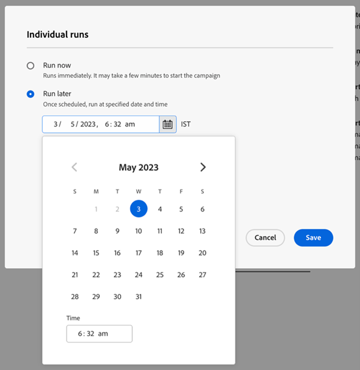
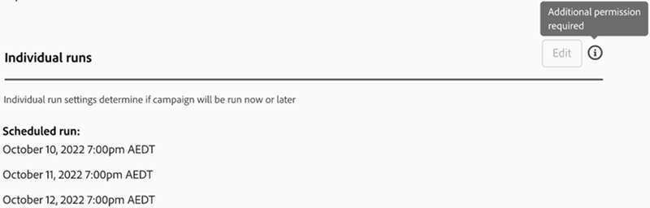

# “设置”选项卡 {#settings-tab}

“设置”选项卡是所有Campaign设置的主页，其中包括与“计划”选项卡相同的权限集和访问权限。 访问此选项卡不会中断???请考虑删除或重新措辞 — LOPA将确认 — 它不会中断任何现有的营销活动设置。

包括以下三个部分。

* **资格规则**：确定每个用户可运行智能营销活动流的次数。

* **单个运行**：可用于安排立即运行或将来的单次运行。

* **循环**：用于安排每日、每周或每月重复执行。

  

资格规则将适用于所有营销活动（触发器和批次），并包括以下设置：

* 您可以确定用户经历营销策划的次数
* 在人员超出其通信限制时阻止非运营营销活动的能力
* 设置中止营销活动人员限制的功能

  

单个运行可用于立即运行营销活动，也可用于设置将来的一些一次性运行。

>[!TIP]
>
>如果您计划了一系列营销活动，则使用周期性模式会更轻松。

重复模式包括能够设置每日、每周或每月重复的计划。 设置后，您将在“设置”选项卡中看到接下来的三个运行。

“设置”选项卡还包括智能列表的简要概述。 包括以下内容：

* 营销活动状态
* 创建日期
* 上次修改时间
* 智能列表模式
* 智能列表状态：
   * 估计将受影响的人员
   * 被电子邮件阻止的预计人数
   * 处于等待步骤的预估人数

“设置”选项卡中的“权限集”和“错误”：

所有现有权限集都将适用于“设置”选项卡。 如果“编辑”按钮呈灰显状态，则表示您没有执行编辑的权限，需要联系Marketo管理员。

添加有关取消计划运行的说明 — 关闭后使用LOPA确认 — >如果用户无权编辑促销活动设置，他们也将无权取消任何计划运行。

