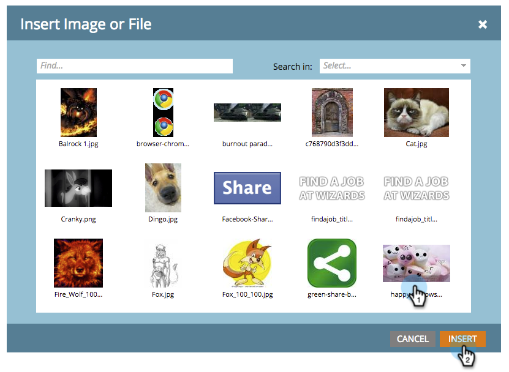

# 为演示添加背景图像 {#add-a-background-image-to-a-presentation}

通过选择背景图像来自定义演示文稿。

>[!PREREQUISITES]
>
>[创建演示文稿](/help/marketo/product-docs/core-marketo-concepts/marketing-calendar/calendar-hd/create-a-presentation.md)

1. 右键单击演示文稿并选择&#x200B;**[!UICONTROL View Setup]**。

   >[!NOTE]
   >
   >也可以双击演示文稿以进入设置选项卡。

   

1. 将&#x200B;**[!UICONTROL Background Image]**&#x200B;从右树拖放到画布中。

   

1. 从图像库中选择图像。

   >[!TIP]
   >
   >若要获得最干净的外观，请使用图像&#x200B;**1920 x 1080**&#x200B;或&#x200B;**1280 x 720**。

   

1. 单击&#x200B;**[!UICONTROL Preview]**&#x200B;进行预览。

   

