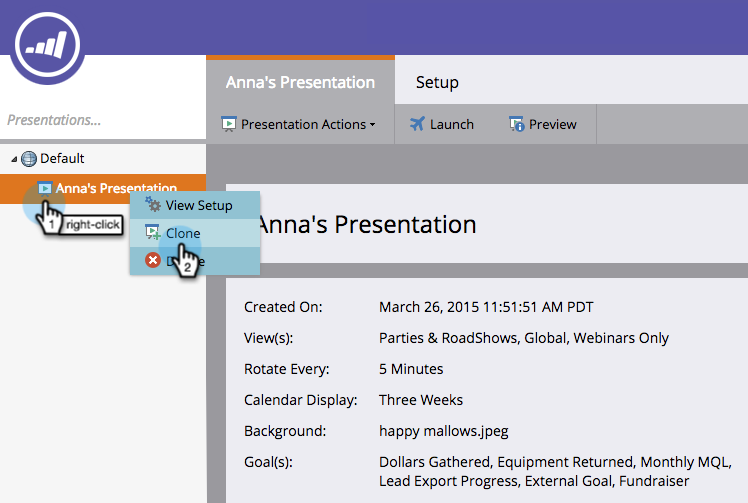

# 克隆演示 {#clone-a-presentation}

克隆演示文稿以供在不同位置重复使用。

1. 选择要克隆的演示文稿。

   

1. 右键单击演示文稿并选择&#x200B;**[!UICONTROL Clone]**。

   

1. 输入克隆演示文稿的名称，然后单击&#x200B;**[!UICONTROL Clone]**。

   

   太棒了！ 演示文稿的精确副本现已存在。
