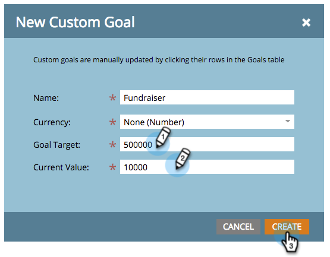

# 创建自定义目标 {#create-a-custom-goal}

目标是跟踪进度和激励团队的方法。 创建后，必须手动更新它们。

与演示文稿一样，目标特定于[工作区](/help/marketo/product-docs/administration/workspaces-and-person-partitions/understanding-workspaces-and-person-partitions.md)。

1. 转到&#x200B;**[!UICONTROL Calendar]**。

   

1. 单击右下角的&#x200B;**[!UICONTROL Presentations]**。

   

1. 选择 **[!UICONTROL Goals]** 选项卡。

   

1. 将&#x200B;**[!UICONTROL Custom Goal]**&#x200B;拖放到画布中。

   

1. 输入目标的名称。 选择&#x200B;**[!UICONTROL Currency]**。

   >[!NOTE]
   >
   >如果目标不是货币值，则可以选择&#x200B;**[!UICONTROL None]**。

   

1. 输入&#x200B;**[!UICONTROL Goal Target]**&#x200B;和&#x200B;**[!UICONTROL Current Value]**&#x200B;的值（如果没有值，请输入&#x200B;**0**）。 接着，单击 **[!UICONTROL Create]**。

   

   已创建您的自定义目标。

   
