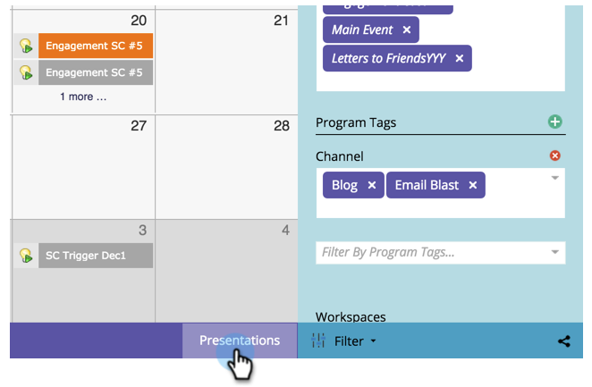

# 创建演示文稿 {#create-a-presentation}

创建演示文稿以在高清电视上展示您团队的日历视图和目标。 Presentations特定于工作区。

>[!AVAILABILITY]
>
>
>并非所有客户都购买了此功能。 有关详细信息，请联系您的销售代表。

1. 转到 **日历**.

   

1. 单击 **演示** 在右下角。

   

1. 单击 **演示操作** 选择 **新演示文稿**.

   

1. 选择演示文稿的名称。 单击&#x200B;**创建**。

   

   干得好！ 现在，您已准备好自定义演示文稿。

>[!MORELIKETHIS]
>
>[自定义演示文稿](/help/marketo/product-docs/core-marketo-concepts/marketing-calendar/calendar-hd/customize-a-presentation.md)
