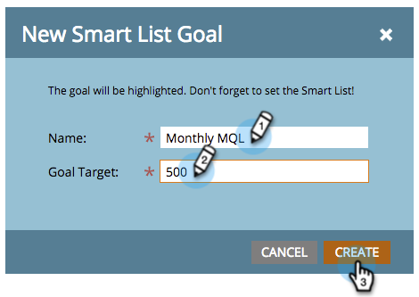

# 创建智能列表目标 {#create-a-smart-list-goal}

目标是指跟踪进度和激励团队的方法。 它们可以与智能列表结合使用，以跟踪Marketo中的各种内容。 此外，在您设置智能列表目标后，当它在演示文稿中使用时，它将每两小时自动更新一次。

与演示文稿一样，目标为 [工作区](/help/marketo/product-docs/administration/workspaces-and-person-partitions/understanding-workspaces-and-person-partitions.md)特定。

1. 转到 **[!UICONTROL 日历]**.

   

1. 单击 **[!UICONTROL Presentations]** 右下角。

   

1. 选择 **[!UICONTROL 目标]** 选项卡。

   

1. 拖放 **[!UICONTROL 智能列表目标]** 到画布上。

   

1. 输入目标的名称并输入 **[!UICONTROL 目标目标]**. 然后单击 **[!UICONTROL 创建]**.

   

1. [定义智能列表](/help/marketo/product-docs/core-marketo-concepts/smart-lists-and-static-lists/creating-a-smart-list/find-and-add-filters-to-a-smart-list.md). 可能性是无穷的！

   

1. 设置完智能列表后，单击 **[!UICONTROL 关闭]** 按钮，然后返回到上一个选项卡。

   

   看啊！ 已创建您的智能列表目标。

   
