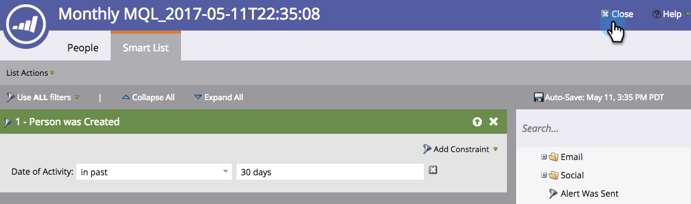

# 创建智能列表目标 {#create-a-smart-list-goal}

目标是跟踪进度和激励团队的方法。 它们可与智能列表结合使用，以在Marketo中跟踪各种量度。 此外，设置智能列表目标后，在演示文稿中使用该目标时，它将每2小时自动更新一次。

与演示文稿一样，目标特定于[工作区](/help/marketo/product-docs/administration/workspaces-and-person-partitions/understanding-workspaces-and-person-partitions.md)。

1. 转到&#x200B;**[!UICONTROL Calendar]**。

   

1. 单击右下角的&#x200B;**[!UICONTROL Presentations]**。

   

1. 选择 **[!UICONTROL Goals]** 选项卡。

   

1. 将&#x200B;**[!UICONTROL Smart List Goal]**&#x200B;拖放到画布上。

   

1. 输入目标的名称并输入&#x200B;**[!UICONTROL Goal Target]**。 接着，单击 **[!UICONTROL Create]**。

   

1. [定义智能列表](/help/marketo/product-docs/core-marketo-concepts/smart-lists-and-static-lists/creating-a-smart-list/find-and-add-filters-to-a-smart-list.md)。

   

1. 配置智能列表后，单击&#x200B;**[!UICONTROL Close]**&#x200B;按钮并返回上一选项卡。

   

   已创建智能列表目标。

   
