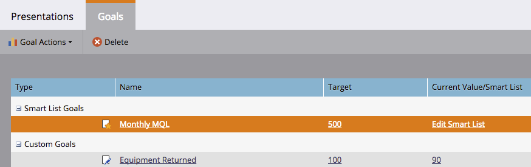

# 创建智能列表目标{#create-a-smart-list-goal}

目标是跟踪进度并激励团队的方式。 它们可以与智能列表结合，在Marketo中跟踪各种事情。 此外，在您设置了智能列表目标后，在演示文稿中使用该目标时，每2小时会自动更新一次。

与演示文稿一样，目标也[工作区](../../../../product-docs/administration/workspaces-and-person-partitions/understanding-workspaces-and-person-partitions.md)特定。

1. 转到&#x200B;**日历**。

   

1. 单击右下角的&#x200B;**演示文稿**。

   

1. 选择**目标**选项卡。

   

1. 将&#x200B;**智能列表目标**&#x200B;拖放到画布上。

   

1. 输入目标的名称，然后输入&#x200B;**目标目标**。 然后单击&#x200B;**创建**。

   

1. [定义智能列表](../../../../product-docs/core-marketo-concepts/smart-lists-and-static-lists/creating-a-smart-list/find-and-add-filters-to-a-smart-list.md)。无限可能！

   

1. 设置完智能列表后，单击&#x200B;**关闭**&#x200B;按钮并返回到上一个选项卡。

   

   看这个！ 您的智能列表目标已创建。

   

