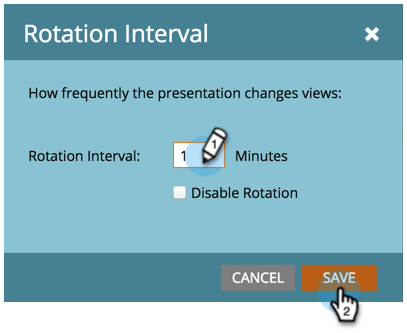

# 自定义演示文稿{#customize-a-presentation}

设置日历演示文稿，以反映对您的团队最重要的目标和活动。

>[!AVAILABILITY]
>
>
>并非所有客户都购买了此功能。 有关详细信息，请与您的销售代表联系。

>[!PREREQUISITES]
>
>* [创建自定](/help/marketo/product-docs/core-marketo-concepts/marketing-calendar/calendar-hd/create-a-custom-goal.md) 义目标 [或智能列表目标](/help/marketo/product-docs/core-marketo-concepts/marketing-calendar/calendar-hd/create-a-smart-list-goal.md)
   >
   >
* [创建演示文稿](/help/marketo/product-docs/core-marketo-concepts/marketing-calendar/calendar-hd/create-a-presentation.md)

## 选择视图{#choosing-the-views}

Presentations循环查看您选择的不同[筛选器定义](/help/marketo/product-docs/core-marketo-concepts/marketing-calendar/working-with-the-calendar/filtering-the-marketing-calendar.md)。 拉入任意数量的视图并自定义频率。

1. 从右侧树中，在演示文稿中要旋转的不同视图中拖动。

   

## 添加目标{#add-a-goal}

Presentations在展示您的团队目标时是最棒的。 只需拖动到不同的[自定义目标](/help/marketo/product-docs/core-marketo-concepts/marketing-calendar/calendar-hd/create-a-custom-goal.md)或[智能列表目标](/help/marketo/product-docs/core-marketo-concepts/marketing-calendar/calendar-hd/create-a-smart-list-goal.md)上即可。 你最多可以用10个。

1. 从右侧树中，拖动要在演示文稿中显示的不同目标。

   

## 设置旋转频率{#set-the-frequency-of-rotation}

在您拉入演示文稿所需的视图后，设置它在不同视图之间旋转的频率。

1. 单击&#x200B;**5分钟**（这是默认节奏）。

   

1. 使用分钟输入时间。 单击&#x200B;**保存**。

   >[!NOTE]
   >
   >通过选中&#x200B;**禁用旋转**&#x200B;显示一个静态视图。

   

## 设置日历显示{#set-the-calendar-display}

日历显示可更改为3周或每月视图。

1. 选择&#x200B;**日历显示**&#x200B;下拉框，然后在&#x200B;**3周**&#x200B;或一个&#x200B;**月**&#x200B;之间进行选择。

   

   太棒了！ 准备好观看您的演示了吗？

>[!TIP]
>
>设置演示文稿的[背景图像](/help/marketo/product-docs/core-marketo-concepts/marketing-calendar/calendar-hd/add-a-background-image-to-a-presentation.md)。 我们建议小猫或彩虹。

## 预览演示文稿{#preview-a-presentation}

配置演示文稿后，即可预览和启动演示文稿。

1. 选择&#x200B;**预览**。

   

   太！ 这是您的演示文稿的外观。

   

   不喜欢你看到的吗？ 返回并使用不同的筛选器定义创建您喜欢的视图。

>[!MORELIKETHIS]
>
>* [向演示文稿添加背景图像](/help/marketo/product-docs/core-marketo-concepts/marketing-calendar/calendar-hd/add-a-background-image-to-a-presentation.md)
>* [启动演示文稿](/help/marketo/product-docs/core-marketo-concepts/marketing-calendar/calendar-hd/launch-a-presentation.md)

