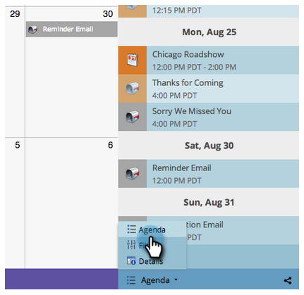

# 导航营销日历 {#navigating-the-marketing-calendar}

在营销日历中导航非常简单，一、二、三！

>[!PREREQUISITES]
>
>确保您拥有 [营销日历许可证](/help/marketo/product-docs/core-marketo-concepts/marketing-calendar/understanding-the-calendar/issue-revoke-a-marketing-calendar-license.md)  — 否则，“营销日历”拼贴将不会显示在我的Marketo中。

1. 转到 **营销日历**.

   

1. 这是对在Marketo实例中计划的资产的鸟瞰视图。

   

## 模式之间的更改 {#change-between-modes}

1. 单击 **3周** 或 **月** 制表符，用于在模式之间切换。

   

## 使用议程视图 {#use-the-agenda-view}

“议程”视图将您的所有条目显示为列表。

1. 单击 **过滤器下拉列表**.

   

1. 选择 **议程** 中。

   

   太棒了！ 这是查看所有计划内容的绝佳视图。

   

## 浏览时间 {#navigate-through-time}

没有德罗林！ 只需单击导航按钮。

您还可以使用这些键盘快捷键。

| 操作 | 键盘快捷键 |
|---|---|
| 返回时间 | alt/opt + up |
| 及时转发 | alt/opt + down |
| 转到“今天” | alt/opt + t |

太棒了！ 这些是基础知识。 您还可以使用过滤器自定义您的视图。

>[!MORELIKETHIS]
>
>[过滤营销日历](/help/marketo/product-docs/core-marketo-concepts/marketing-calendar/working-with-the-calendar/filtering-the-marketing-calendar.md)
