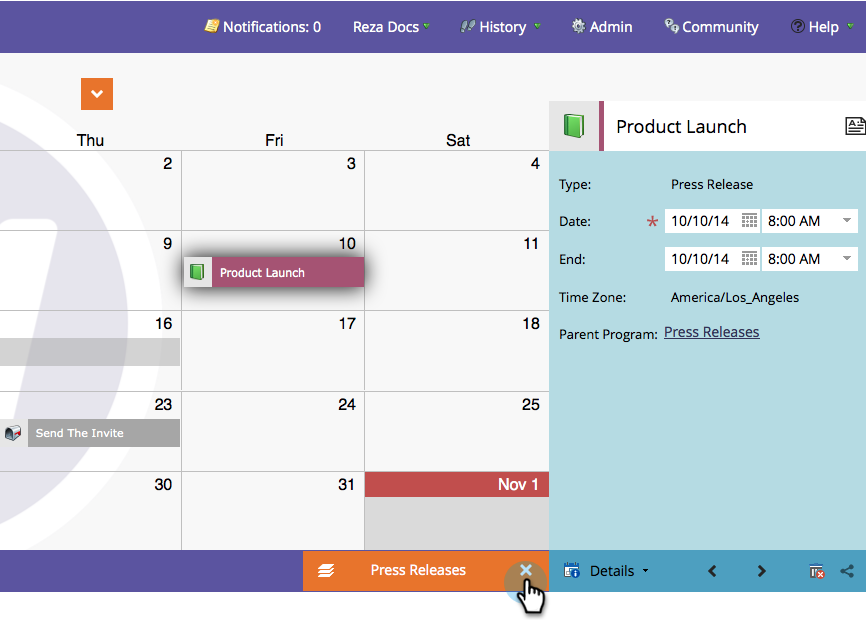

# 了解/启用项目聚焦 {#understand-enable-program-focus}

营销日历可让您以鸟瞰图查看各种物品，但它也允许进行一些交互。 您可以 [创建](/help/marketo/product-docs/core-marketo-concepts/marketing-calendar/working-with-the-calendar/create-entries-directly-in-the-marketing-calendar.md){target="_blank"}, [edit](/help/marketo/product-docs/core-marketo-concepts/marketing-calendar/working-with-the-calendar/edit-entries-directly-in-the-marketing-calendar.md){target="_blank"}, [delete](/help/marketo/product-docs/core-marketo-concepts/marketing-calendar/working-with-the-calendar/delete-entries-directly-in-the-marketing-calendar.md){target="_blank"}, and [confirm](/help/marketo/product-docs/core-marketo-concepts/marketing-calendar/working-with-the-calendar/confirm-entries-directly-in-the-marketing-calendar.md){target="_blank"} 个条目。 要与条目交互，您必须先关注项目。

1. 转到 **营销日历**.

   

1. 选择一个条目，然后单击 **[!UICONTROL 显示项目群焦点]**.

   

1. 请注意，我们现在将重点放在“新闻发布”计划上。

   

   >[!NOTE]
   >
   >通过关注项目，您只能与属于该项目的条目进行交互，并创建将由它存放的新条目。

1. 完成后，释放焦点以与其他程序/条目交互。

   

太棒了！ 现在，继续学习如何与条目交互。

>[!MORELIKETHIS]
>
>* [直接在营销日历中创建条目](/help/marketo/product-docs/core-marketo-concepts/marketing-calendar/working-with-the-calendar/create-entries-directly-in-the-marketing-calendar.md){target="_blank"}
>* [直接在营销日历中编辑条目](/help/marketo/product-docs/core-marketo-concepts/marketing-calendar/working-with-the-calendar/edit-entries-directly-in-the-marketing-calendar.md){target="_blank"}
>* [直接在营销日历中删除条目](/help/marketo/product-docs/core-marketo-concepts/marketing-calendar/working-with-the-calendar/delete-entries-directly-in-the-marketing-calendar.md){target="_blank"}
>* [直接在营销日历中确认条目](/help/marketo/product-docs/core-marketo-concepts/marketing-calendar/working-with-the-calendar/confirm-entries-directly-in-the-marketing-calendar.md){target="_blank"}
