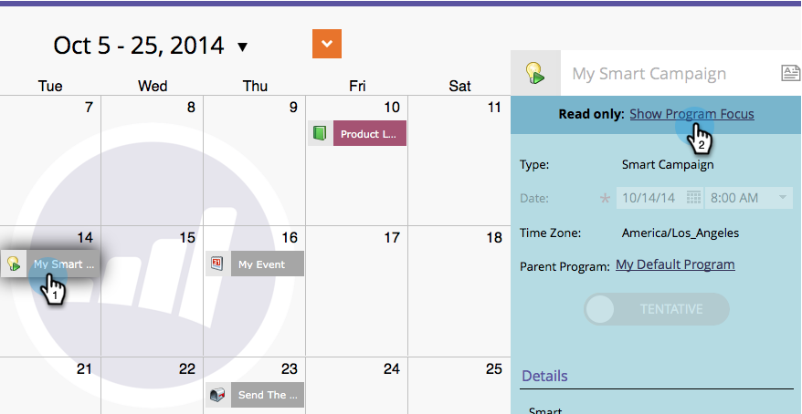
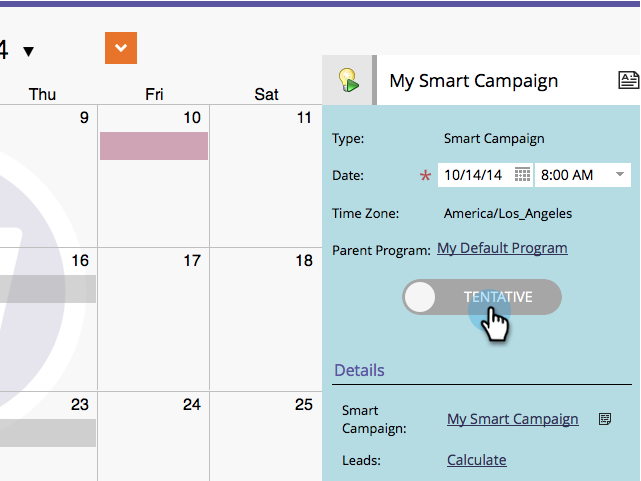
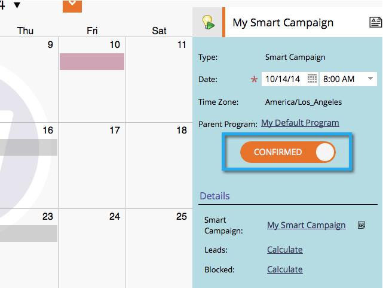

# 在营销日程表中直接确认条目 {#confirm-entries-directly-in-the-marketing-calendar}

智能营销活动和电子邮件程序可以创建为暂定条目，并且必须确认是否实际发生了任何事件。

1. 转到&#x200B;**[!UICONTROL Calendar]**。

   

1. 选择要确认的项目，然后单击&#x200B;**[!UICONTROL Show Program Focus]**。

   

1. 确认条目。

   

   确认运行一系列验证流程，如果所有内容都已签出，则将确认条目。

   
