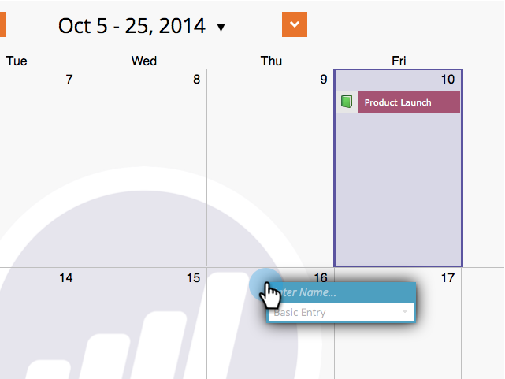

# 在营销日程表中直接创建条目 {#create-entries-directly-in-the-marketing-calendar}

Marketo允许您使用项目焦点模式，直接在营销日历中创建条目。 可以创建以下条目类型：

* 基本条目
* 自定义条目
* 电子邮件项目
* 智能营销活动

1. 单击&#x200B;**[!UICONTROL Calendar]**&#x200B;磁贴。

   

1. 选择上一个条目并单击&#x200B;**[!UICONTROL Show Program Focus]**。

   

1. 进入项目集中模式后，请选择您选择的日期以添加条目。

   

1. 命名条目并选择类型。

   

   >[!TIP]
   >
   >请注意，您也可以以相同的方式创建&#x200B;**智能营销活动**、**电子邮件计划**&#x200B;和&#x200B;**基本条目**。

1. 完成编辑后，关闭程序焦点模式。

   

>[!MORELIKETHIS]
>
>[直接在营销日历中编辑条目](/help/marketo/product-docs/core-marketo-concepts/marketing-calendar/working-with-the-calendar/edit-entries-directly-in-the-marketing-calendar.md){target="_blank"}
