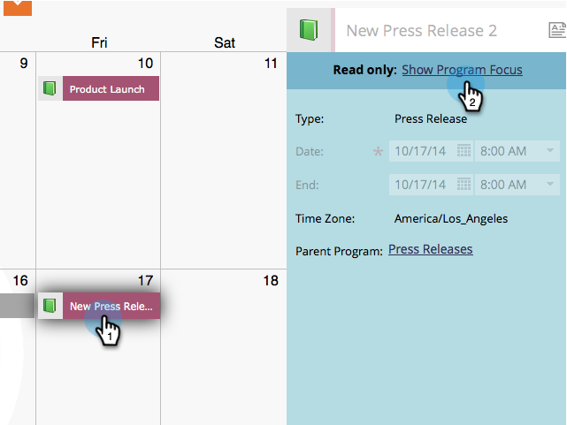

# 在营销日程表中直接删除条目 {#delete-entries-directly-in-the-marketing-calendar}

除了[创建](/help/marketo/product-docs/core-marketo-concepts/marketing-calendar/working-with-the-calendar/create-entries-directly-in-the-marketing-calendar.md){target="_blank"}和[编辑](/help/marketo/product-docs/core-marketo-concepts/marketing-calendar/working-with-the-calendar/edit-entries-directly-in-the-marketing-calendar.md){target="_blank"}条目之外，您还可以直接在营销日历中删除它们。

1. 单击&#x200B;**MU**&#x200B;磁贴。

   

1. 选择要删除的项目并单击&#x200B;**[!UICONTROL Show Program Focus]**。

   

1. 单击垃圾桶图标。

   

根据条目，您可能需要确认删除。

>[!MORELIKETHIS]
>
>[直接在营销日历中确认条目](/help/marketo/product-docs/core-marketo-concepts/marketing-calendar/working-with-the-calendar/confirm-entries-directly-in-the-marketing-calendar.md){target="_blank"}
