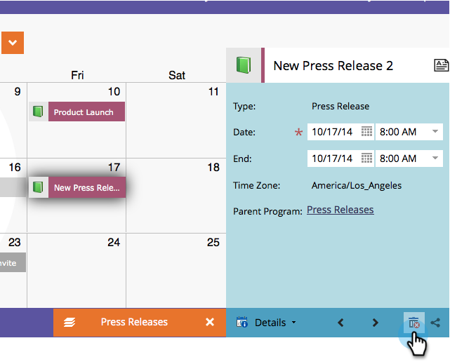

# 直接在营销日历{#delete-entries-directly-in-the-marketing-calendar}中删除条目

除了创建和[编辑](edit-entries-directly-in-the-marketing-calendar.md)条目外，您还可以在营销日历中直接删除它们。 这是方法。

1. 转到&#x200B;**日历**。

   

1. 选择要删除的条目，然后单击&#x200B;**显示项目焦点**。

   

1. 单击垃圾桶图标。

   

根据条目，您可能必须确认删除。 但就这样！ 轻松。

>[!MORELIKETHIS]
>
>* [直接在营销日历中确认条目](confirm-entries-directly-in-the-marketing-calendar.md)

>

