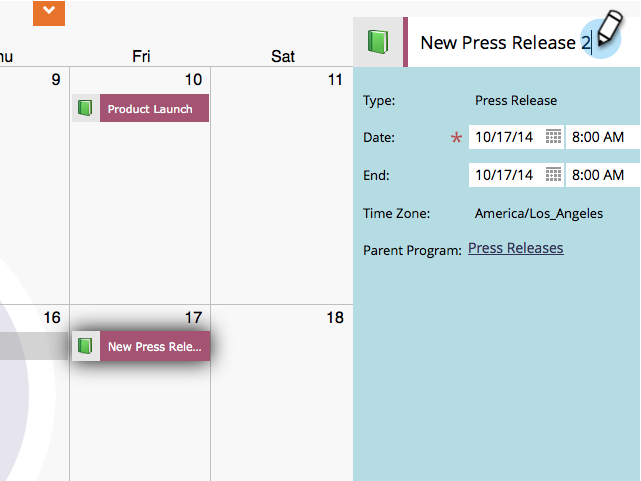
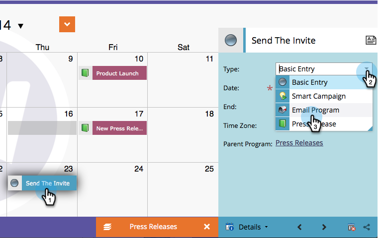

# 直接在营销日历{#edit-entries-directly-in-the-marketing-calendar}中编辑条目

进入项目焦点模式后，您可以快速更改日历条目。 下面介绍如何操作。

## 启用项目焦点{#enable-program-focus}

1. 转到&#x200B;**日历**。

   

1. 选择属于要聚焦的项目的条目，然后单击&#x200B;**显示项目焦点**。

   

## 重新计划条目{#reschedule-entry}

1. 只需拖放一个条目即可重新计划它。

   

## 编辑条目名称{#edit-entry-name}

1. 选择要重命名的条目。

   

1. 编辑条目名称。

   

   >[!TIP]
   >
   >您还可以编辑描述。
   >
   >

## 转换条目类型{#convert-entry-type}

在基本条目中快速进行了预计后，您可以将它们转换为最终形式。

1. 查找并选择要转换和更改其类型的基本条目。

   

## 编辑条目详细信息{#edit-entry-details}

您可以快速访问条目的不同区域进行编辑。

1. 右键单击某个条目，然后选择要编辑的区域。

   

就这样！ 正如您所看到的，您可以直接从“营销日历”执行许多操作。

>[!MORELIKETHIS]
>
>[直接在营销日历中删除条目](/help/marketo/product-docs/core-marketo-concepts/marketing-calendar/working-with-the-calendar/delete-entries-directly-in-the-marketing-calendar.md)
