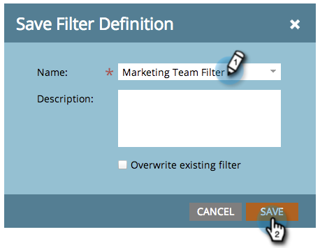
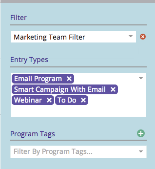

# 在营销日程表中保存过滤器定义 {#saving-a-filter-definition-in-the-marketing-calendar}

保存过滤器允许您在不同的过滤器定义之间来回切换。

>[!PREREQUISITES]
>
>[正在筛选营销日历](/help/marketo/product-docs/core-marketo-concepts/marketing-calendar/working-with-the-calendar/filtering-the-marketing-calendar.md){target="_blank"}

1. 定义过滤器。

   

1. 单击保存图标。

   

1. 命名过滤器。 单击 **[!UICONTROL Save]**。

   

   现已保存该筛选器。

   

   或者，[将定义的副本](/help/marketo/product-docs/core-marketo-concepts/marketing-calendar/working-with-the-calendar/sharing-a-filter-definition-in-the-marketing-calendar.md){target="_blank"}发送给其他Marketo用户。

   >[!NOTE]
   >
   >[在营销日历中共享筛选器定义](/help/marketo/product-docs/core-marketo-concepts/marketing-calendar/working-with-the-calendar/sharing-a-filter-definition-in-the-marketing-calendar.md){target="_blank"}
