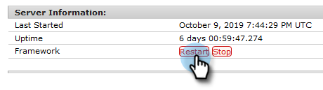

# 配置Adobe Experience Manager集成 {#configuring-adobe-experience-manager-integration}

配置Adobe Experience Manager (AEM)，以便您可以访问、选择AEM资源并将其导入Marketo Engage设计工作室。

>[!NOTE]
>
>**需要管理员权限**

>[!IMPORTANT]
>
>* 此集成仅适用于AEM的内部部署，AEM Cloud Service实施不支持此集成。
>
>* 目前，仅在Firefox中完全支持此功能。 该工具在Safari中不受支持，并且可能在最新版本的Chrome中不起作用，具体取决于您的SameSite Cookie设置。

1. 导航到Adobe Experience Manager （URL特定于您的公司）。

   

1. 您可以使用Adobe登录或本地登录。 在本例中，我们将本地登录。

   

1. 在 **工具**，单击 **操作** 并选择 **Web控制台**.

   

1. 在浏览器中搜索(Windows上按ctrl+f，Mac上按cmd+f)“AdobeGranite跨源资源共享策略”。

   

1. 单击 **+** 在右侧签名。

   

1. 在 **允许的源（正则表达式）** 文本框，键入 `https://.*\.marketo\.com` 并单击 **保存**.

   

1. 在页面顶部的标题中，单击 **Web控制台** 并选择 **系统信息**.

   

1. 在“服务器信息”下，单击 **重新启动** 按钮。

   

1. 单击 **确定** 以确认。

   

1. 在Marketo Engage中，单击 **管理员**.

   

1. 在集成下，选择 **Adobe Experience Manager**.

   

1. 单击 **编辑**.

   

1. 输入您的AEM URL并单击 **确定**.

   
