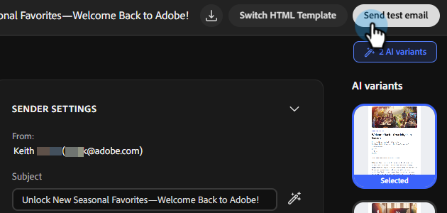

# 创建电子邮件营销活动 {#create-an-email-campaign}

了解如何在几分钟内生成并查看完整的电子邮件营销活动。

>[!IMPORTANT]
>
>此时，您只能生成营销活动，但尚未能发送（启动）它们。 Launch功能即将推出。

## 开始之前

确保您拥有：

* 有效的Adobe CX Enterprise Co-worker Campaigns帐户([在此注册](https://coworker-essentials.experience.adobe.com/){target="_blank"}（如果尚未注册）)。

* 您的品牌已添加在&#x200B;**您的资料** > **品牌**&#x200B;下。

* （可选但推荐）在&#x200B;**您的资料** > **电子邮件模板**&#x200B;下上载的HTML电子邮件模板。

* 准备上传的受众CSV。

* 清楚了解您的营销活动目标（例如，“赢回失去的客户”或“邀请试用用户参加网络研讨会”。）

## 步骤1：开始新聊天

从主页开始，您有三种方法：

**选项一**：在中央提示栏中键入提示。

_使用时间：您确切知道自己需要什么时。_

**选项二**：从提示栏下方的&#x200B;**营销活动模板**&#x200B;部分中选择现成的模板。

_使用时间：当您不确定所需内容时。_

**选项三**：使用提示栏中的下拉列表中的“帮助我提示”选项，让同事营销活动指导您撰写提示。

_何时使用：您可能知道自己想要什么，但希望得到一点帮助（或者，使用“惊喜我”来让我吃惊）时。_

{width="800" zoomable="yes"}

## 第2步：创建提示

强有力的同事活动提示包括：

* 营销活动目标（您正在尝试实现的目标）。
* 受众（面向谁或受众数据来自何处）。
* 格式和结构（电子邮件数量、节奏、音调）。
* 品牌或上下文提示（对您的品牌、产品或营销活动的引用）。

示例：

`"Create a single-touch win-back email campaign for customers who bought last year but haven't returned. Use the CSV I am uploading. Make sure the content feels seasonal."`

>[!TIP]
>
>有关更多示例，请参阅&#x200B;_用例_&#x200B;一文。

>[!NOTE]
>
>如果您已经拥有Campaign Brief，请将其与提示一起上传，作为它将为您生成的计划的附加上下文。

提示就绪后，单击&#x200B;**生成营销活动**。 然后，同事营销活动将：

* 生成结构化的活动计划。
* 请求您的目标受众，该受众还将用于内容个性化。
* 草稿每个步骤的个性化电子邮件内容。
* 在此过程中动态构建旅程。
* 将所有内容组合到一个活动展示板上。

## 步骤3：上传受众

通过CSV上传受众。 所有受众均特定于其各自的营销活动（此时，它们不会存储在您环境中的任何其他位置）。

1. 提交提示后，查看同事将执行的任务，然后单击&#x200B;**生成**。

1. 在左侧的&#x200B;_促销活动转化_&#x200B;窗格中，单击&#x200B;**上传CSV**。

   

   >[!NOTE]
   >
   >* 电子邮件地址是必填字段、名字、上次购买日期以及任何其他可用于个性化的字段。

1. 导入CSV文件。

   >[!IMPORTANT]
   >
   >在上传之前，排除您不希望通过电子邮件发送的任何联系人（已取消订阅的用户、内部地址、测试帐户）。 虽然我们将在试用期间逐步启用排除特定用户或添加属性的功能，但从发布日期起将无法立即使用。

## 步骤4：查看和优化Campaign Assets

要对电子邮件进行更改，请向右滚动。 在&#x200B;_促销活动Assets_&#x200B;下，单击&#x200B;**打开编辑器**。

可通过两种方式更新您的内容。

* 通过选择电子邮件中的各个部分手动进行任何所需的更改（例如：替换主题行、更新图像等）。

 — 或 — 

* 使用对话式界面，通过与同事营销活动直接对话来进行更改。 一些示例包括：

   * “让主题更加紧迫。”
   * “缩短正文。”
   * “让call to action更加强大。”

您还可以使用AI按钮帮助优化主题或预编译标头。

## 步骤5：发送测试电子邮件

在启动之前，请将营销活动发送给您自己，以便您在实际收件箱中查看该活动。 使用此选项可确保电子邮件以您需要的方式呈现，链接有效，任何个性化设置准确无误等。

>[!NOTE]
>
>此时，您只能向自己发送测试电子邮件，一次只能发送一封电子邮件。

## 步骤6：后续步骤

Launch功能（发送电子邮件促销活动）即将推出。 在此之前，您可以与团队一起查看内容，并开始您的下一个营销活动。

## 常见问题解答

**为什么第一个响应需要这么长时间？**

它可以为您生成整个营销活动，包括策略、所需受众、工作流等。生成内容后首次响应的平均时间通常约为1分钟。

**如果同事营销活动输出不太正确，我该怎么做？**

单击标题中的反馈图标，通知我们，以便我们改进平台。

**我是否可以直接编辑电子邮件，还是只能通过聊天编辑电子邮件？**

你可以两者兼顾。

**如何保存营销活动而不启动它？**

所有营销活动都会自动保存。 如果您需要访问最近的对话，则这些对话位于左侧的窗口中（如果您尚未构建营销活动，则位于&#x200B;**聊天**&#x200B;下；如果您已构建营销活动，则位于&#x200B;**营销活动**&#x200B;下）。

**我的CSV上传是否存在文件大小限制？**

是，大小限制为8MB。

**如果我的受众CSV返回错误，该怎么办？**

确保CSV文件不包含“富”隐藏字符。

**如何使用活动模板？**

选择所需的模板并单击&#x200B;**混音**。 然后，您可以更新所有个性化令牌并单击右下角的&#x200B;**发送**&#x200B;图标。

**如何与队友共享营销活动草稿以供审阅？**

此时没有“共享”按钮。 但是，您可以将内容下载为HTML，或将其导出为PDF或Word文档。
