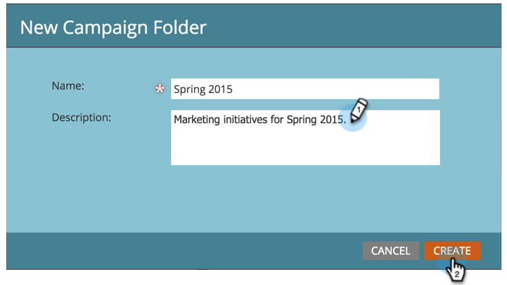

# 创建新营销活动文件夹 {#create-new-campaign-folder}

Campaign文件夹可帮助您保持工作区的整洁。 请按照以下步骤开始。

1. 前往 **[!UICONTROL Marketing Activities]**。

   

1. 选择 **[!UICONTROL New]**。

   

1. 选择 **[!UICONTROL New Campaign Folder]**。

   

1. 为营销活动文件夹输入&#x200B;**[!UICONTROL Name]**。

   

1. 可选：输入&#x200B;**[!UICONTROL Description]**&#x200B;并单击&#x200B;**[!UICONTROL Create]**。

   >[!TIP]
   >
   >说明适用于订阅上的其他用户。 您的客户不会看到此消息。

   

   Campaign文件夹会显示在树中。

   

   现在，在[创建新项目](/help/marketo/product-docs/core-marketo-concepts/programs/creating-programs/create-a-program.md)时，此活动文件夹将显示为一个选项。

>[!MORELIKETHIS]
>
>* [创建项目](/help/marketo/product-docs/core-marketo-concepts/programs/creating-programs/create-a-program.md)
>* [创建新的智能营销活动](/help/marketo/product-docs/core-marketo-concepts/smart-campaigns/creating-a-smart-campaign/create-a-new-smart-campaign.md)
