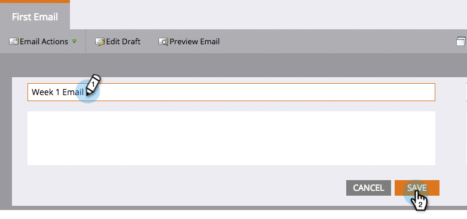

# 将营销人员重命名为资产{#rename-a-marketo-asset}

文件夹、项目和本地资产均可轻松重命名。

1. 选择要重命名的任何资产，然后单击右面板名称块。

   

1. 在文本字段中键入新名称。 单击&#x200B;**保存**。

   

   >[!NOTE]
   >
   >您不能重命名已上传的文件和图像，或者当前在智能列表或智能活动中引用的资产(在过滤器、触发器、流步骤等中)。
