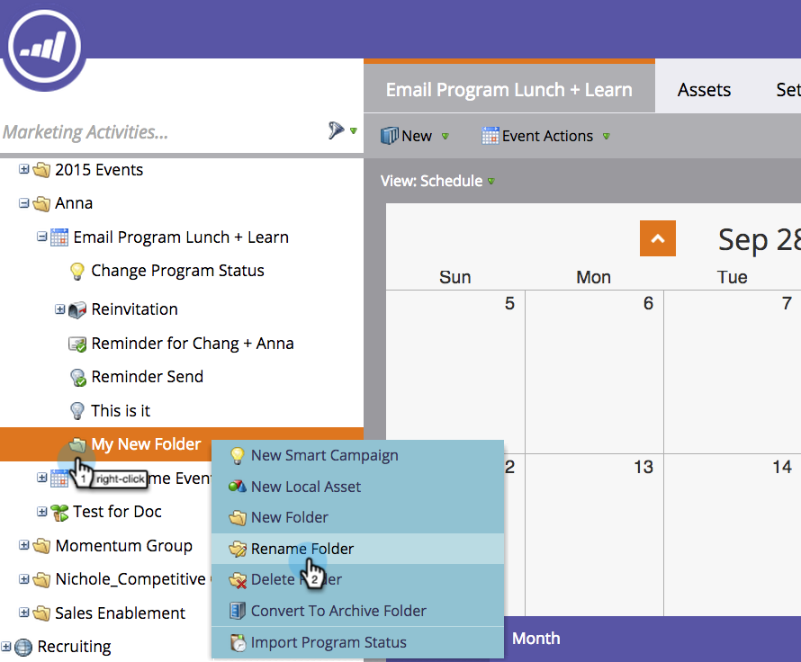

# 了解文件夹 {#understanding-folders}

项目中的文件夹可用于组织您的智能营销活动和资产。 这些文件夹与[营销活动文件夹](/help/marketo/product-docs/core-marketo-concepts/miscellaneous/create-new-campaign-folder.md)不同。

## 创建文件夹 {#create-a-folder}

1. 进入 **[!UICONTROL Marketing Activities]** 区域。

   

1. 右键单击项目并选择&#x200B;**[!UICONTROL New Folder]**。

   {width="600" zoomable="yes"}

1. 命名新文件夹并按&#x200B;**[!UICONTROL Enter]**。

   {width="600" zoomable="yes"}

新文件夹现已可供您的本地资产使用。

## 重命名文件夹 {#rename-a-folder}

1. 右键点击该文件夹，并选择 **[!UICONTROL Rename Folder]**。

   {width="600" zoomable="yes"}

1. 键入新名称并按&#x200B;**[!UICONTROL Enter]**。

   {width="600" zoomable="yes"}

## 删除文件夹 {#delete-a-folder}

>[!NOTE]
>
>在删除文件夹之前，请确保该文件夹为空。

1. 右键点击该文件夹，并选择 **[!UICONTROL Delete Folder]**。

   {width="600" zoomable="yes"}

## 存档文件夹 {#archive-a-folder}

在Marketo中，您可以将现有文件夹转换为存档文件夹。 存档文件夹存在于[!UICONTROL Marketing Activities]、[!UICONTROL Database]和[!UICONTROL Design Studio]中。

{width="600" zoomable="yes"}

存档文件夹时：

* 文件夹和资产在搜索结果中不再可见。 如果搜索存档文件夹中的项目或事件，结果将返回存档文件夹的折叠视图
* 文件夹中的资产不再出现在自动建议中
* 在Design Studio中创建电子邮件或登陆页面时，存档的模板不可用
* 存档的页面无法在登陆页面测试组中使用

存档时&#x200B;**不会**&#x200B;更改的功能：

* 全局搜索仍会在已存档的文件夹中找到结果
* 您可以使用过滤器选择存档的资产以用于报告

### 在存档上禁用营销活动 {#disable-campaigns-archive}

存档文件夹或项目群，或将活动的智能营销活动移动到已存档的文件夹中时，Marketo Engage会停止运行受影响的营销活动：

* **触发的营销活动**&#x200B;已停用。
* **批次营销活动**&#x200B;已取消其挂起的运行。
* **可执行营销活动**&#x200B;没有运行状态，因此不执行任何操作。

**支持的操作**

以下操作可停用营销活动：

* 将包含活动营销活动的&#x200B;**文件夹**&#x200B;拖放到已存档的文件夹中
* 将包含活动营销活动的&#x200B;**项目**（任何类型）拖放到存档文件夹中
* 将&#x200B;**单个智能营销活动**&#x200B;拖放到已存档文件夹中
* 在单个智能营销活动上右键单击&#x200B;**将**&#x200B;移动到已存档文件夹中
* 在包含活动营销活动的文件夹上右键单击&#x200B;**将文件夹**&#x200B;移动到已存档文件夹中
* 在包含活动营销活动的项目上右键单击&#x200B;**将**&#x200B;移动到已存档文件夹中
* 在文件夹上右键单击&#x200B;**转换为已存档文件夹**&#x200B;以将其存档到适当位置而不移动它

>[!NOTE]
>
>如果在其他位置（例如，通过“请求营销活动”流程步骤）引用了要存档的文件夹或项目中的某个智能营销活动，则会阻止存档，以防止破坏该其他营销活动。
