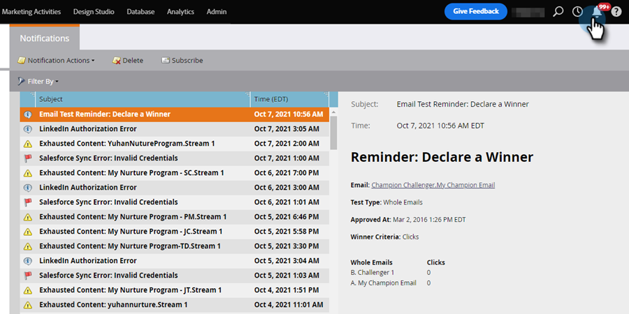

# 了解通知 {#understanding-notifications}

通知可让您及时了解Marketo订阅中发生的系统事件。 例如，Campaign失败通知会通知您智能营销活动中的错误，而CRM同步通知会提醒您注意在CRM同步中发现的严重问题，例如权限不正确或同步已关闭。

## 概述 {#overview}

1. 新通知显示在Marketo的右上角。

   

1. 单击通知以查看所有通知。

   

## 订阅通知 {#subscribe-to-notifications}

您可以订阅通知，以便在电子邮件中接收这些通知。

1. 转到“通知”并单击 **[!UICONTROL 订阅]**.

   

1. 选择通知类型并输入要接收通知的电子邮件地址（用逗号分隔）。 单击 **[!UICONTROL 订阅]** 完成时。

   

>[!NOTE]
>
>此 **[!UICONTROL 发送至]** 区域仅供您输入电子邮件，不会显示现有订阅者的列表。

在某些情况下，通知会提供“查看完整列表”链接以下载逗号分隔值(CSV)文件，例如Microsoft Dynamics同步错误文件。 Marketo会将这些CSV文件保留30天。 如果您在30天后尝试下载文件，则会出现404错误。

>[!TIP]
>
>想要取消订阅通知电子邮件？ 没问题。 只需单击 **[!UICONTROL 取消订阅通知]** 电子邮件底部的链接。
