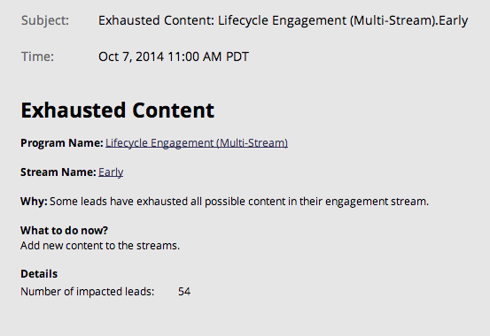

# 通知类型{#notification-types}

有多种通知类型。

## 活动故障{#campaign-failure}

活动故障会通知您智能活动中的错误。

## CRM同步{#crm-sync}

CRM同步通知会提醒您CRM同步发现的严重问题，如权限不正确或同步关闭。

**Microsoft Dynamics**

动态通知每24小时发送一次，并包含在该时间段内无法同步的潜在客户。 失败的典型原因是重复线索（如上所示）或字段长度不匹配错误。

**Salesforce**

如果使用Salesforce，则同步错误通知的外观与下面类似。 典型错误包括过期的凭据和超出的API限制。

参与

当流中的潜在客户耗尽时，我们会发送通知。  通知包括已用尽的潜在客户的数量和其他一些信息。

Facebook

如果您尝试在未接受服务条款的情况下将潜在客户发送到Facebook，或者在删除Marketo应用程序后尝试将潜在客户发送到Facebook。

空闲触发器活动清理

取消激活已触发的智能活动，不再获得任何活动。 了解有关[自动触发器活动清理](/help/marketo/product-docs/core-marketo-concepts/smart-campaigns/using-smart-campaigns/automatic-trigger-campaign-cleanup.md)的更多信息。

LinkedIn

当Marketo尝试三次后无法创建新受众、登录或将电子邮件推送到LinkedIn时。

Web服务

达到每日配额时，将通知您。 配额会在中央时间的每晚午夜重置。

>[!NOTE]
>
>我们的[开发人员文档](https://developers.marketo.com/rest-api/error-codes/#response_level_error_codes)中概述了您可能收到的一些错误代码。
