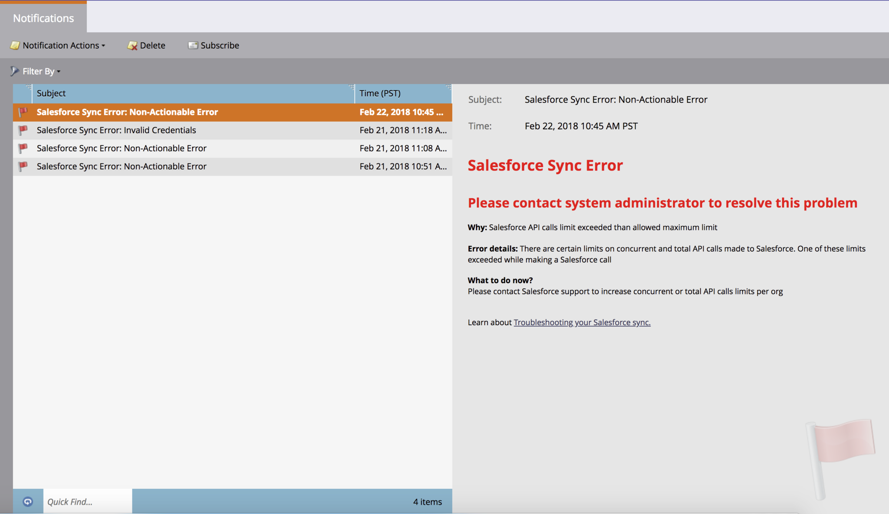

# 通知类型 {#notification-types}

通知类型有多种。

## 营销活动失败  {#campaign-failure}

营销活动失败会通知您智能营销活动中存在错误。

## CRM同步 {#crm-sync}

CRM同步通知会提醒您CRM同步存在严重问题，例如权限不正确或同步已关闭。

**Microsoft Dynamics**

Dynamics通知每24小时发送一次，并包含在该时间段内未能同步的潜在客户。 失败的典型原因是重复的潜在客户（如上所述）或字段长度不匹配错误。

**Salesforce**

如果您使用Salesforce，则同步错误通知类似于下面的通知。 典型错误包括过期的凭据和超出的API限制。

参与度

当流中的潜在客户耗尽时，我们会发送通知。  通知包括已用尽的潜在客户数量和一些其他信息。

Facebook

如果您尝试在不接受服务条款的情况下将潜在客户发送到Facebook，或者在删除Marketo应用程序后尝试将潜在客户发送到Facebook。

空闲触发器促销活动清理

停用不再获取任何活动的触发智能营销活动。 详细了解  [自动触发器营销活动清理](/help/marketo/product-docs/core-marketo-concepts/smart-campaigns/using-smart-campaigns/automatic-trigger-campaign-cleanup.md).

LinkedIn

当Marketo在三次尝试后无法创建新受众、登录或将电子邮件推送到LinkedIn时。

Web服务

达到每日配额时，系统会通知您。 配额每晚中午时分重置。

>[!NOTE]
>
>您可能收到的一些错误代码在 [开发人员文档](https://developers.marketo.com/rest-api/error-codes/#response_level_error_codes).
