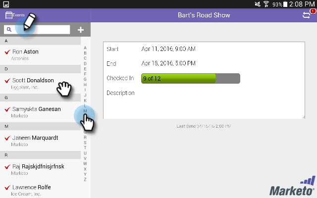

# 通过平板电脑将人员登记到您的活动中 {#check-people-into-your-event-from-your-tablet}

当人们出现在您的活动上时，您可以在应用程序上找到他们的信息。 签入后，当您同步到Marketo时，这些帐户会提升为已参与状态。

该应用程序在iPad和Android上的工作方式相同，不同之处仅在于布局和设计方面的细微差异。

>[!PREREQUISITES]
>
>* 在Marketo中创建事件，并在其中填充受邀和已注册的人员。
>* 下载适用于的平板电脑应用程序 [Android](https://play.google.com/store/apps/details?id=com.marketo.eventcheckin&amp;hl=en) 或 [iOS](https://itunes.apple.com/us/app/marketo-events/id522766637?mt=8)

## 登记注册嘉宾 {#check-in-registered-guests}

1. 点按iPad或Android平板电脑上的应用程序图标。

1. 点按 **登录** 以启动Marketo事件应用程序。

   

1. 输入您的Marketo用户名和密码，然后单击 **登录**.

   >[!NOTE]
   >
   >您必须拥有有权访问数据库的角色，才能查看应用程序中的人员。

1. 选择 **事件**.

   

   >[!TIP]
   >
   >仅显示安排在今天日期之前一周和之后一周的事件程序（网络研讨会除外）。

1. 在主屏幕上，浏览以查找已注册的来宾。 要在列表中查找人员，您可以：

   * 滚动以查找名称
   * 在搜索字段中输入名称
   * 通过点按列表右侧的，跳转到姓氏的特定首字母

   >[!NOTE]
   >
   >iPad和Android上的过程相同，但屏幕不同，项目可能位于不同的位置。 本文介绍了iPad界面。 请比较本节中的Android屏幕以供参考。

   **iPad**

   

   **Android**

   

1. 点按选定的名称，然后在人员记录上点按 **签入**.

   

来宾现在处于“已参加”状态，并会收到复选标记。 与Marketo同步时，人员记录会更新。 “同步”按钮上的红色计数器递增，以显示自上次与Marketo同步以来签入的数量。 对于iPad和Android，“同步”按钮看起来不一样并且位于不同的位置：

**iPad**

**Android**

>[!TIP]
>
>如果某人受邀但未注册，则可以通过单击 **在服务器上搜索**，位于“搜索”框的正下方。 “已邀请”状态更改为 **已参加** 为活动准备的。

## 在平板电脑上创建新人员 {#create-a-new-person-on-the-tablet}

您可以手动添加在Marketo数据库中不属于现有人员的来宾。 当您与Marketo同步时，它们将自动签入并添加到您的数据库中。

1. 单击 **添加**.

   **iPad**

   

   **Android**

   

1. 填写尽可能多的基本信息字段，然后点击 **完成**.

   

   >[!NOTE]
   >
   >您只能使用现有字段。 无法创建自定义受众。

   >[!CAUTION]
   >
   >仔细检查电子邮件地址。 其他字段稍后可以更正，但电子邮件地址是联系来宾的主要方法。

新用户已注册为已签入您的事件，当您同步到Marketo时，新用户将被添加到Marketo数据库，并具有“已参加”状态。

## 反转签入 {#reverse-a-check-in}

如果你不小心签到了一个人， _在与Marketo同步之前_，您可以反转已参与状态。

1. 点按列表中的名称，然后在人员记录中，点按 **撤消**.

   

   全部修复！

## 签入时编辑人员记录 {#edit-a-person-record-at-check-in}

您可以直接在活动上添加和修改来宾信息！

1. 点按人员列表中的名称并点按 **编辑**.

   

1. 编辑信息并将其添加到字段中，然后点按 **完成**.

   

   >[!NOTE]
   >
   >在Android中， **完成** 按钮可能处于隐藏状态。 向下滚动以找到它。

在将应用程序与Marketo同步时，将会更新信息。

## 将应用程序与Marketo同步 {#sync-the-app-with-marketo}

在将活动同步回Marketo数据库之前，Marketo Events应用程序会独立工作。 最好在上次签入后尽快同步。 平板电脑必须连接到Internet。

>[!CAUTION]
>
>同步后，无法从应用程序撤消签入。

1. 在平板电脑上，打开应用程序并导航到您的事件。

1. 点按 **同步**.

   您的事件将通过Marketo数据库中的新签入进行更新。 “同步”按钮上的红色计数器将清除，直到您签入其他人。

   出于安全原因，您应在完成同步后退出Marketo Events应用程序。

## 使用有限的Internet访问 {#working-with-limited-internet-access}

有些场馆的网络连接很差。 您需要与以下对象建立良好的连接：

* 下载并安装应用程序
* 登录
* 选择事件
* 将应用程序与Marketo同步

如果您担心会场中的Internet访问，您可能需要登录到Marketo Events应用程序，并在具有强大Internet访问能力的位置提前选择您的活动。 这样一来，您仍可以脱机使用应用程序。 然后，在重新建立Internet连接时，立即同步到Marketo数据库。

>[!TIP]
>
>如果您没有Internet连接，您仍然可以为签入人员创建一个新人员。 当您同步应用程序时，它将与现有人员保持一致。

>[!NOTE]
>
>应用程序会在您处于非活动状态八小时后自动将您注销。
