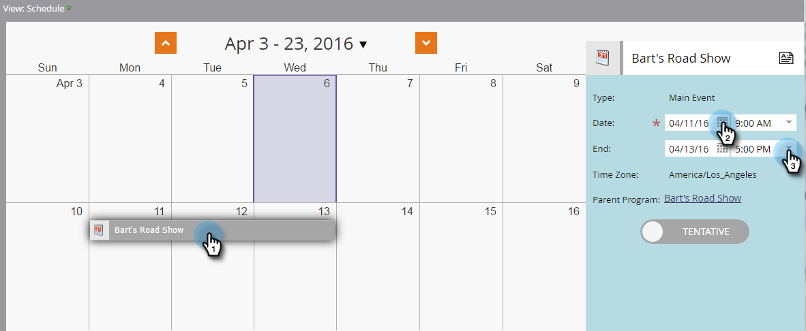

# 为事件做准备 {#prepare-for-your-event}

您必须执行几项操作来为活动做好准备。

## 创建新的Marketo角色 {#create-a-new-marketo-role}

Marketo对事件签入应用程序具有特殊的用户角色。 [创建新的Marketo角色](/help/marketo/product-docs/core-marketo-concepts/mobile-apps/event-check-in/grant-users-access-to-the-check-in-app.md) 对于iPad或Android用户，具有访问移动应用程序的权限。

## 邀请新平板电脑用户参加该事件 {#invite-new-tablet-users-to-the-event}

[邀请新平板电脑用户参加该活动](/help/marketo/product-docs/core-marketo-concepts/mobile-apps/event-check-in/grant-users-access-to-the-check-in-app.md) 然后为他们分配新角色。

## 创建新的Marketo事件计划 {#create-a-new-marketo-event-program}

[创建新的Marketo事件程序](/help/marketo/product-docs/demand-generation/events/understanding-events/create-a-new-event-program.md) 以捕获人员在不同阶段的进展状态，并准确衡量营销活动的ROI。

## 指定事件日期 {#specify-the-event-dates}

设置事件日期是一个快照。

1. 单击计划中的事件，然后设置开始和结束日期和时间。

   

1. 滑过以更改 **试探性** to **已确认**.

   

   >[!CAUTION]
   >
   >如果事件的日期在当前日期之前或之后超过一周，则您的事件将不会显示在应用程序中。 **笔尖**:要进行测试，请将日期暂时设置为在今天的一周内。 在测试事件后，请记住将事件返回到正确的日期。

## 将人员添加到您的事件 {#add-people-to-your-event}

既然你知道 *when*，则该将 *who*.

1. 如果您已经有人员列表，请在我的Marketo中单击 **数据库** 拼贴。

   

1. 选择包含人员的列表，然后单击 **人员** 选项卡。

   

1. 从列表中选择活动的人员。 使用 **Ctrl** (或 **命令** (在Mac上)单击多个人，或 **全选** 来标记所有的。

   

1. 单击 **人员操作**，悬停 **程序** 选择 **更改程序状态**.

   

1. 单击 **项目** 下拉列表，然后选择您的事件。

   

1. 单击 **新状态** 下拉框并选择 **路演>注册**. 单击 **立即运行**.

   

1. 小窗口显示进度……

   

1. ...和指示任务何时完成。

   

   现在，选定的人员即已进入您的活动，可使用展厅上的平板电脑应用程序签入。
