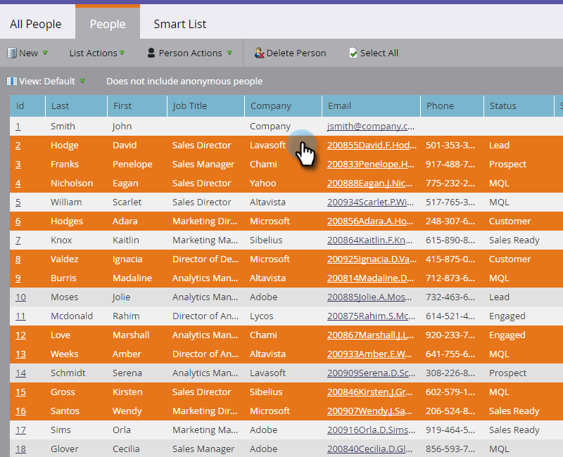

# 准备事件{#prepare-for-your-event}

要准备事件，您必须做几件事。

## 创建新的营销人员角色{#create-a-new-marketo-role}

Marketo对事件登记应用程序具有特殊的用户角色。 [为iPad或Android用户](/help/marketo/product-docs/core-marketo-concepts/mobile-apps/event-check-in/grant-users-access-to-the-check-in-app.md) 新建一个Marketo角色，并具有访问移动应用程序的权限。

## 邀请新平板电脑用户加入事件{#invite-new-tablet-users-to-the-event}

[邀请新平板电脑用户](/help/marketo/product-docs/core-marketo-concepts/mobile-apps/event-check-in/grant-users-access-to-the-check-in-app.md) 参加活动并为他们分配新角色。

## 创建新的营销事件项目{#create-a-new-marketo-event-program}

[创建新的营销事件](/help/marketo/product-docs/demand-generation/events/understanding-events/create-a-new-event-program.md) 计划，以在人员在不同阶段的进展过程中捕获他们的状态，并准确衡量您的营销活动的ROI。

## 指定事件日期{#specify-the-event-dates}

设置事件日期非常简单。

1. 单击计划上的事件，然后设置开始和结束日期和时间。

   

1. 滑过以将&#x200B;**暂定**&#x200B;更改为&#x200B;**已确认**。

   

   >[!CAUTION]
   >
   >如果事件的日期在当前日期之前或之后超过一周，您的事件将不会显示在应用程序中。 **提示**:要进行测试，请暂时将日期设置为今天的一周内。在测试事件后，请记住将其返回到正确的日期。

## 将人员添加到事件{#add-people-to-your-event}

现在您知道&#x200B;*何时*，该添加&#x200B;*谁*&#x200B;了。

1. 如果您已经拥有列表，请在My Marketo中单击&#x200B;**数据库**&#x200B;拼贴。

   

1. 选择具有人员的列表，然后单击&#x200B;**人员**&#x200B;选项卡。

   

1. 从事件中为列表选择人物。 使用&#x200B;**Ctrl**（或Mac上的&#x200B;**Command**）单击多个人，或使用&#x200B;**选择全部**&#x200B;标记所有人。

   

1. 单击“**人员操作**”，将指针悬停在&#x200B;**项目**&#x200B;上，然后选择“更改项目状态&#x200B;**”。**

   

1. 单击&#x200B;**项目**&#x200B;下拉列表，然后选择您的事件。

   

1. 单击&#x200B;**新建状态**&#x200B;下拉框，然后选择&#x200B;**路演>已注册**。 单击&#x200B;**立即运行**。

   

1. 小窗口显示进度……

   

1. ...并指示任务何时完成。

   

   选定人员现在已进入您的事件，可以使用展会上的平板电脑应用程序进行登记。
