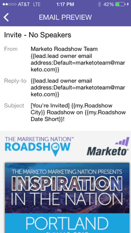

# 了解电子邮件程序信息卡 {#understanding-email-program-cards}

使用Marketo时刻从您的手机或iPad查看您的电子邮件程序。

## 以电子邮件发送程序卡 {#email-program-cards}

点按任意电子邮件程序信息卡后，您可以：

* [将电子邮件设为收藏夹](/help/marketo/product-docs/core-marketo-concepts/mobile-apps/marketo-moments/working-with-moments/creating-a-favorite.md)
* [将电子邮件标记为完成](/help/marketo/product-docs/core-marketo-concepts/mobile-apps/marketo-moments/working-with-moments/marking-it-done.md)
* [共享电子邮件时刻卡](/help/marketo/product-docs/core-marketo-concepts/mobile-apps/marketo-moments/working-with-moments/sharing-a-moment.md)

在尚未发送的电子邮件的电子邮件程序信息卡上，您可以找到有关该电子邮件程序的状态和受众的信息。

发送电子邮件后，信息卡会显示其他重要信息，包括已投放的电子邮件的数量、收件人的操作以及营销活动中使用的智能列表的链接。

## 确认电子邮件卡 {#confirming-an-email-card}

1. 要确认未确认的电子邮件卡，请点按三个点菜单。

   

1. 点按 **确认**.

   

1. 点按 **确认** 完成工作，或者 **没关系** 如果你有后顾之忧。

   

   >[!NOTE]
   >
   >现在，您的卡将变为橙色！

## 取消电子邮件信息卡发送 {#canceling-an-email-card-send}

1. 如果您决定不向外发送确认电子邮件，请点按三个圆点菜单。

   

1. 点按 **取消发送**.

   

## 重新计划电子邮件卡 {#rescheduling-an-email-card}

您可以重新计划已确认或未确认的电子邮件卡。

>[!NOTE]
>
>对于已确认的电子邮件，您必须先取消电子邮件（请参阅下文）。

1. 要重新计划电子邮件，请点按三点菜单。

   

1. 点按 **重新计划**.

   

1. 在日历上选择一个日期并点按 **重新计划**.

   

   只要有无线服务，您就可以从任何地方重新安排时间！

## 发送示例 {#sending-a-sample}

您可以直接与他人共享电子邮件时刻示例。

1. 打开“信息卡”菜单。

   

1. 点按 **发送示例**.

   

1. 输入电子邮件地址并单击 **发送示例**.

   

## 预览电子邮件 {#previewing-an-email}

右键单击电子邮件信息卡以进行预览。

1. 点按 **预览电子邮件**.

   

   这样一来，在触发之前，您就知道自己的电子邮件是完美的！

   

   太棒了！

这是查看电子邮件促销活动的独家新闻。 现在，你是专业人士！

>[!MORELIKETHIS]
>
>* [了解Marketo时刻](/help/marketo/product-docs/core-marketo-concepts/mobile-apps/marketo-moments/understanding-moments/understanding-marketo-moments.md)
>* [了解事件信息卡](/help/marketo/product-docs/core-marketo-concepts/mobile-apps/marketo-moments/understanding-moments/understanding-event-cards.md)
>* [了解Analytics信息卡](/help/marketo/product-docs/core-marketo-concepts/mobile-apps/marketo-moments/understanding-moments/understanding-analytics-cards.md)
